# 🥇 Data Engineering Fundamentals - Niveau 1
## Guide Complet des Fondamentaux Data Engineering

### Introduction : Les Bases Essentielles du Data Engineering

Le Data Engineering est la discipline qui permet de construire, maintenir et optimiser l'infrastructure nécessaire pour collecter, stocker, traiter et analyser des données à grande échelle. C'est le fondement sur lequel reposent toutes les initiatives data-driven d'une organisation.

**Objectifs de ce niveau :**
- Comprendre les concepts fondamentaux du Data Engineering
- Maîtriser les outils et technologies de base (Python, SQL, Cloud)
- Construire des pipelines ETL simples mais robustes
- Développer une pensée architecturale pour les systèmes de données
- Créer un portfolio de projets concrets et documentés

**Approche pédagogique :**
Notre méthode suit le cycle **Learn → Build → Show → Repeat** :
- **Learn** : Acquisition des concepts théoriques
- **Build** : Application pratique dans des projets concrets
- **Show** : Démonstration des compétences via un portfolio
- **Repeat** : Itération et amélioration continue

#### Objectifs Mesurables

À la fin de ces 2 semaines, vous serez capable de :
1. Coder un ETL complet en Python sans chercher sur ChatGPT toutes les 5 minutes
2. Concevoir et implémenter un pipeline de données moderne avec Airflow + DBT
3. Discuter architecture data avec assurance (batch vs streaming, data lake vs warehouse)
4. Résoudre des problèmes SQL complexes en live (window functions, CTEs, optimisation)
5. Déployer une infrastructure data basique sur le cloud
6. Montrer 2-3 projets GitHub professionnels comme portfolio

---

## 🏗️ **Architecture Data Engineering - Vue d'Ensemble**

### **Landscape des Technologies Data Engineering**

```mermaid
graph TB
    subgraph "Data Sources"
        A[Databases] --> A1[PostgreSQL]
        A --> A2[MySQL]
        A --> A3[MongoDB]
        A --> A4[Oracle]
        B[APIs] --> B1[REST APIs]
        B --> B2[GraphQL]
        B --> B3[Webhooks]
        C[Files] --> C1[CSV/JSON]
        C --> C2[Parquet/Avro]
        C --> C3[XML]
        D[Streaming] --> D1[Kafka]
        D --> D2[IoT Devices]
        D --> D3[Clickstream]
    end
    
    subgraph "Data Ingestion"
        E[ETL Tools] --> E1[Apache Airflow]
        E --> E2[DBT]
        E --> E3[Apache NiFi]
        E --> E4[Fivetran]
        F[CDC Tools] --> F1[Debezium]
        F --> F2[Oracle GoldenGate]
        F --> F3[AWS DMS]
    end
    
    subgraph "Data Processing"
        G[Batch Processing] --> G1[Apache Spark]
        G --> G2[Apache Hadoop]
        G --> G3[Pandas]
        H[Stream Processing] --> H1[Apache Flink]
        H --> H2[Kafka Streams]
        H --> H3[Spark Streaming]
        I[SQL Engines] --> I1[Presto/Trino]
        I --> I2[Apache Drill]
        I --> I3[BigQuery]
    end
    
    subgraph "Data Storage"
        J[Data Lakes] --> J1[AWS S3]
        J --> J2[Azure Data Lake]
        J --> J3[Google Cloud Storage]
        K[Data Warehouses] --> K1[Snowflake]
        K --> K2[Redshift]
        K --> K3[BigQuery]
        L[Databases] --> L1[ClickHouse]
        L --> L2[TimescaleDB]
        L --> L3[InfluxDB]
    end
    
    subgraph "Data Serving"
        M[BI Tools] --> M1[Tableau]
        M --> M2[Power BI]
        M --> M3[Looker]
        N[APIs] --> N1[FastAPI]
        N --> N2[Flask]
        N --> N3[GraphQL]
        O[ML Platforms] --> O1[SageMaker]
        O --> O2[Databricks]
        O --> O3[Vertex AI]
    end
    
    A --> E
    B --> E
    C --> E
    D --> E
    E --> G
    E --> H
    G --> J
    H --> J
    J --> K
    K --> M
    K --> N
    K --> O
```

### **Relations entre Frameworks et Outils**

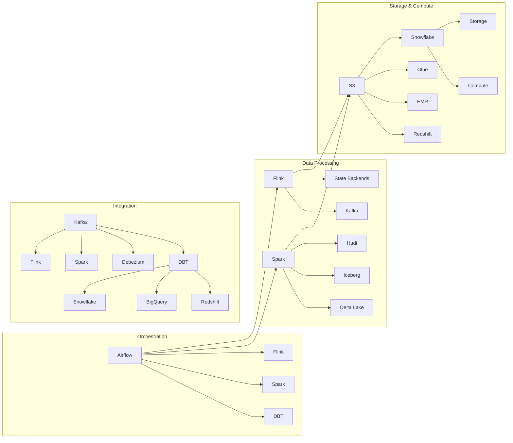

---

## 🐍 **Python Data Engineering - Fondations Solides**

### **Les Structures de Données Avancées**

Commençons par maîtriser les structures Python essentielles pour la data. Les dictionnaires sont votre pain quotidien en data engineering - ils représentent les JSON, les configurations, les mappings. En data engineering, vous manipulez constamment des données structurées et semi-structurées, et la maîtrise des structures Python avancées est cruciale pour construire des pipelines robustes et performants.

Les dictionnaires Python offrent une flexibilité exceptionnelle pour représenter des données hiérarchiques. Dans un contexte de pipeline data, vous rencontrerez souvent des configurations complexes avec des niveaux d'imbrication multiples. La méthode `get()` avec valeurs par défaut est votre meilleure amie pour éviter les erreurs de clés manquantes qui peuvent faire planter un pipeline en production.

```python
# Pattern 1: Nested dict handling avec get() pour éviter les KeyError
config = {
    'pipeline': {
        'source': {'type': 'postgres', 'host': 'localhost'},
        'destination': {'type': 's3', 'bucket': 'data-lake'}
    }
}

# Mauvais: config['pipeline']['source']['port']  # KeyError!
# Bon: 
source_port = config.get('pipeline', {}).get('source', {}).get('port', 5432)

# Pattern 2: Dict comprehension pour transformation
raw_data = [
    {'id': 1, 'name': 'Alice', 'score': '85'},
    {'id': 2, 'name': 'Bob', 'score': '92'}
]

# Transformer les scores en int
processed = [
    {**record, 'score': int(record['score'])} 
    for record in raw_data
]

# Pattern 3: defaultdict pour agrégations
from collections import defaultdict

sales_by_region = defaultdict(list)
for sale in sales_data:
    sales_by_region[sale['region']].append(sale['amount'])

# Pattern 4: Counter pour analyses rapides
from collections import Counter

event_types = Counter(event['type'] for event in event_stream)
top_5_events = event_types.most_common(5)
```

**Générateurs et Yield : Traiter des GB sans exploser la RAM**

Les générateurs sont cruciaux pour traiter de gros volumes. Comprenons vraiment comment ils fonctionnent :

```python
# Exemple concret : Parser un gros CSV ligne par ligne
def read_large_csv(filepath, chunk_size=10000):
    """
    Lit un CSV par chunks pour éviter de charger tout en mémoire
    """
    with open(filepath, 'r') as file:
        headers = file.readline().strip().split(',')
        
        chunk = []
        for line in file:
            values = line.strip().split(',')
            record = dict(zip(headers, values))
            chunk.append(record)
            
            if len(chunk) >= chunk_size:
                yield chunk
                chunk = []
        
        # Yield le dernier chunk s'il existe
        if chunk:
            yield chunk

# Utilisation
for batch in read_large_csv('huge_file.csv'):
    process_batch(batch)
```

### **Pandas Avancé pour la Production**

Pandas est l'outil de référence pour la manipulation de données en Python, mais son utilisation en production nécessite une approche différente de celle du prototypage. En production, vous devez gérer des volumes de données considérables, optimiser la mémoire et garantir la performance. Les optimisations de Pandas ne sont pas des détails techniques mais des prérequis pour des pipelines industriels.

L'optimisation des types de données est fondamentale. Par défaut, Pandas utilise des types génériques comme `int64` et `float64` qui consomment beaucoup de mémoire. En spécifiant des types appropriés comme `int32` ou `float32`, vous pouvez réduire la consommation mémoire de 50% sans perte de précision. Cette optimisation devient critique quand vous traitez des millions de lignes.

Le chunking est une technique essentielle pour traiter des fichiers trop volumineux pour tenir en mémoire. En divisant un gros fichier en morceaux gérables, vous pouvez traiter des datasets de plusieurs gigaoctets sur des machines avec une RAM limitée. Cette approche est particulièrement utile dans les environnements cloud où la mémoire est facturée à l'usage.

La vectorisation est le principe fondamental de Pandas. Contrairement aux boucles Python traditionnelles, les opérations vectorisées exploitent les optimisations C sous-jacentes de NumPy. Remplacer un `apply()` par une opération vectorisée peut améliorer les performances d'un facteur 10 à 100. Cette différence devient critique dans les pipelines de production où le temps de traitement se traduit directement en coûts.

```python
# Pattern 1: Utiliser les types dtypes appropriés
# Mauvais: pandas infère automatiquement (lent + mémoire)
df = pd.read_csv('large_file.csv')

# Bon: spécifier les types
dtypes = {
    'user_id': 'int32',  # au lieu de int64
    'amount': 'float32',  # au lieu de float64
    'category': 'category',  # pour les strings répétées
    'date': 'datetime64[ns]'
}
df = pd.read_csv('large_file.csv', dtype=dtypes)

# Pattern 2: Chunking pour gros fichiers
chunk_size = 100000
for chunk in pd.read_csv('huge_file.csv', chunksize=chunk_size):
    # Traiter chaque chunk
    processed_chunk = process_chunk(chunk)
    processed_chunk.to_sql('table_name', engine, if_exists='append', index=False)

# Pattern 3: Vectorisation au lieu de apply
# Mauvais: apply sur chaque ligne
df['is_premium'] = df.apply(lambda row: row['amount'] > 1000, axis=1)

# Bon: vectorisation
df['is_premium'] = df['amount'] > 1000
```

## 🗄️ **SQL Mastery pour Data Engineering**

### **Window Functions : Votre Arme Secrète**

Les Window Functions représentent l'évolution naturelle de SQL pour l'analytique avancée. Contrairement aux fonctions d'agrégation classiques qui réduisent plusieurs lignes en une seule, les Window Functions permettent de calculer des valeurs tout en préservant toutes les lignes originales. Cette capacité est révolutionnaire pour l'analyse de données complexes et la création de métriques business sophistiquées.

Les Window Functions sont particulièrement puissantes pour l'analyse temporelle et la segmentation de données. Elles permettent de calculer des moyennes mobiles, des totaux cumulatifs, et des rangs relatifs sans avoir à écrire des requêtes complexes avec des sous-requêtes ou des jointures auto-référentielles. Cette simplicité d'écriture se traduit par des performances supérieures car l'optimiseur de base de données peut traiter ces opérations de manière optimisée.

L'utilisation des Window Functions nécessite une compréhension profonde des concepts de partitionnement et d'ordonnancement. Le partitionnement divise les données en groupes logiques (par exemple, par utilisateur ou par région), tandis que l'ordonnancement définit l'ordre dans lequel les calculs sont effectués. Cette combinaison permet de créer des analyses multidimensionnelles complexes avec une syntaxe SQL claire et maintenable.

```sql
-- Pattern 1: Running totals avec window functions
SELECT 
    date,
    amount,
    SUM(amount) OVER (ORDER BY date) as running_total,
    AVG(amount) OVER (ORDER BY date ROWS BETWEEN 6 PRECEDING AND CURRENT ROW) as moving_avg_7d
FROM daily_sales
ORDER BY date;

-- Pattern 2: Partitioning pour analyses par groupe
SELECT 
    user_id,
    order_date,
    amount,
    ROW_NUMBER() OVER (PARTITION BY user_id ORDER BY order_date DESC) as order_rank,
    LAG(amount, 1) OVER (PARTITION BY user_id ORDER BY order_date) as prev_amount
FROM orders;

-- Pattern 3: CTEs pour requêtes complexes
WITH user_stats AS (
    SELECT 
        user_id,
        COUNT(*) as order_count,
        SUM(amount) as total_spent,
        AVG(amount) as avg_order_value
    FROM orders
    GROUP BY user_id
),
user_segments AS (
    SELECT 
        user_id,
        CASE 
            WHEN total_spent > 1000 THEN 'Premium'
            WHEN total_spent > 500 THEN 'Regular'
            ELSE 'Occasional'
        END as segment
    FROM user_stats
)
SELECT 
    us.segment,
    COUNT(*) as user_count,
    AVG(us.avg_order_value) as avg_order_value
FROM user_segments us
JOIN user_stats ust ON us.user_id = ust.user_id
GROUP BY us.segment;
```

### **Optimisation et Indexation**

L'optimisation des performances SQL va bien au-delà de la simple réécriture de requêtes. Elle nécessite une compréhension profonde de la façon dont les bases de données exécutent les requêtes et comment les données sont organisées physiquement. L'optimisation SQL est un art qui combine la théorie des bases de données avec l'expérience pratique et la compréhension des patterns d'usage.

L'utilisation d'EXPLAIN ANALYZE est la première étape de toute optimisation SQL. Cette commande révèle le plan d'exécution choisi par l'optimiseur de base de données, montrant comment les tables sont scannées, quels index sont utilisés, et où les goulots d'étranglement se situent. Sans cette analyse, l'optimisation reste un exercice de devinettes qui peut aggraver les performances au lieu de les améliorer.

La création d'index est une science qui nécessite de comprendre les patterns de requêtes de votre application. Un index mal conçu peut ralentir les insertions et mises à jour tout en n'améliorant pas les performances de lecture. Les index composites sont particulièrement puissants car ils permettent d'optimiser des requêtes qui filtrent sur plusieurs colonnes simultanément.

Le partitionnement est une technique avancée qui divise physiquement une grande table en tables plus petites basées sur une valeur de colonne (généralement la date). Cette approche améliore drastiquement les performances des requêtes qui filtrent sur la colonne de partitionnement, car la base de données peut ignorer complètement les partitions non pertinentes. Le partitionnement est essentiel pour les tables qui croissent continuellement et dépassent plusieurs centaines de gigaoctets.

```sql
-- Pattern 1: EXPLAIN ANALYZE pour diagnostiquer
EXPLAIN (ANALYZE, BUFFERS) 
SELECT user_id, SUM(amount) 
FROM orders 
WHERE order_date >= '2024-01-01' 
GROUP BY user_id;

-- Pattern 2: Index composites pour requêtes multi-colonnes
CREATE INDEX idx_orders_date_user ON orders(order_date, user_id);

-- Pattern 3: Partitioning pour gros volumes
CREATE TABLE orders_partitioned (
    order_id SERIAL,
    user_id INTEGER,
    amount DECIMAL(10,2),
    order_date DATE
) PARTITION BY RANGE (order_date);

-- Créer les partitions
CREATE TABLE orders_2024_01 PARTITION OF orders_partitioned
FOR VALUES FROM ('2024-01-01') TO ('2024-02-01');
```

## ☁️ **Architecture Data et Cloud**

### **Data Lake vs Data Warehouse vs Data Lakehouse**

L'architecture des systèmes de données modernes a évolué considérablement au cours de la dernière décennie. Les organisations ne se contentent plus d'un simple data warehouse traditionnel ; elles ont besoin de flexibilité, de performance et de coût-efficacité. Comprendre les différences entre ces trois approches est crucial pour concevoir des architectures qui répondent aux besoins business actuels et futurs.

Le Data Lake représente l'approche la plus flexible pour le stockage de données. Il accepte les données dans leur format brut, sans transformation préalable, ce qui permet une ingestion rapide et économique. Cette flexibilité est particulièrement précieuse dans les phases d'exploration et de découverte, où les besoins analytiques ne sont pas encore clairement définis. Cependant, cette flexibilité a un coût : les données brutes sont difficiles à interroger efficacement et nécessitent souvent des transformations complexes avant d'être utilisables par les analystes.

Le Data Warehouse traditionnel, en revanche, impose une structure rigide dès l'ingestion. Les données doivent être transformées et modélisées selon un schéma prédéfini avant d'être stockées. Cette approche garantit des performances de requête optimales et une cohérence des données, mais limite la flexibilité et peut ralentir l'innovation. Les data warehouses sont parfaits pour les cas d'usage analytiques bien définis et répétitifs.

Le Data Lakehouse représente la convergence de ces deux approches, offrant le meilleur des deux mondes. Il combine la flexibilité du data lake avec les garanties ACID et les performances du data warehouse. Cette architecture émergente utilise des formats de fichiers avancés comme Delta Lake, Iceberg ou Hudi pour fournir des transactions ACID sur des données stockées dans des formats ouverts comme Parquet. Le Data Lakehouse permet aux organisations d'itérer rapidement sur leurs modèles de données tout en maintenant la performance et la fiabilité nécessaires pour les applications de production.

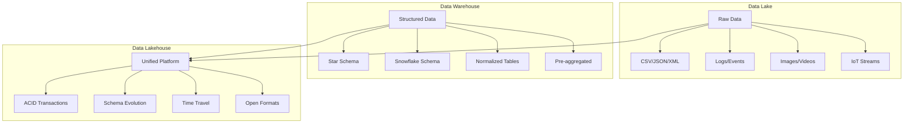

```python
# Pattern 1: Architecture Lambda (Batch + Streaming)
class LambdaArchitecture:
    def __init__(self):
        self.batch_layer = BatchLayer()
        self.speed_layer = SpeedLayer()
        self.serving_layer = ServingLayer()
    
    def process_data(self, data_stream):
        # Speed layer: traitement temps réel
        real_time_results = self.speed_layer.process(data_stream)
        
        # Batch layer: traitement complet
        batch_results = self.batch_layer.process(data_stream)
        
        # Serving layer: fusion des résultats
        return self.serving_layer.merge(real_time_results, batch_results)

# Pattern 2: Configuration d'infrastructure cloud
cloud_config = {
    'aws': {
        'data_lake': 's3://my-data-lake',
        'warehouse': 'redshift-cluster',
        'compute': 'emr-cluster',
        'orchestration': 'airflow-mwaa'
    },
    'azure': {
        'data_lake': 'adls://my-data-lake',
        'warehouse': 'synapse-workspace',
        'compute': 'databricks-workspace',
        'orchestration': 'data-factory'
    }
}
```

#### Jour 6-7 : Déploiement Cloud

**Infrastructure as Code avec Terraform**

```hcl
# Pattern 1: Data Lake S3
resource "aws_s3_bucket" "data_lake" {
  bucket = "my-company-data-lake-${random_string.suffix.result}"
  
  tags = {
    Environment = "production"
    Purpose     = "data-engineering"
  }
}

# Pattern 2: Redshift Cluster
resource "aws_redshift_cluster" "data_warehouse" {
  cluster_identifier = "data-warehouse"
  database_name      = "analytics"
  master_username    = var.db_username
  master_password    = var.db_password
  node_type          = "dc2.large"
  cluster_type       = "single-node"
  
  tags = {
    Environment = "production"
    Purpose     = "data-warehouse"
  }
}

# Pattern 3: EMR Cluster pour processing
resource "aws_emr_cluster" "data_processing" {
  name          = "data-processing-cluster"
  release_label = "emr-6.10.0"
  applications  = ["Spark", "Hadoop"]
  
  ec2_attributes {
    subnet_id = aws_subnet.private.id
    key_name  = aws_key_pair.data_engineering.key_name
  }
  
  master_instance_group {
    instance_type = "m5.xlarge"
  }
  
  core_instance_group {
    instance_type  = "m5.xlarge"
    instance_count = 2
  }
}
```

---

## SEMAINE 2 : Projets Concrets et Portfolio

### Jour 8-10 : Projet 1 - ETL Pipeline Complet

**Architecture du Projet**

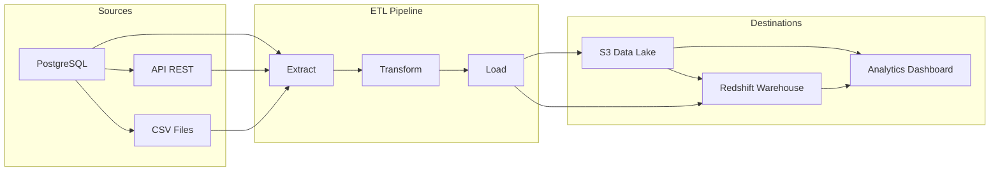

```python
# Structure du projet
data_engineering_project/
├── src/
│   ├── extractors/
│   │   ├── postgres_extractor.py
│   │   └── api_extractor.py
│   ├── transformers/
│   │   ├── data_cleaner.py
│   │   └── business_logic.py
│   ├── loaders/
│   │   ├── s3_loader.py
│   │   └── redshift_loader.py
│   └── orchestrator/
│       └── pipeline.py
├── tests/
├── config/
├── requirements.txt
└── README.md

# Pattern 1: Configuration centralisée
import yaml
from pathlib import Path

def load_config():
    config_path = Path(__file__).parent / "config" / "pipeline.yaml"
    with open(config_path, 'r') as file:
        return yaml.safe_load(file)

# Pattern 2: Extractor pattern
class DataExtractor:
    def __init__(self, config):
        self.config = config
    
    def extract(self):
        raise NotImplementedError

class PostgresExtractor(DataExtractor):
    def extract(self):
        # Logique d'extraction PostgreSQL
        pass

class APIExtractor(DataExtractor):
    def extract(self):
        # Logique d'extraction API
        pass
```

### Jour 11-12 : Projet 2 - Streaming avec Kafka + Flink

**Architecture Streaming**

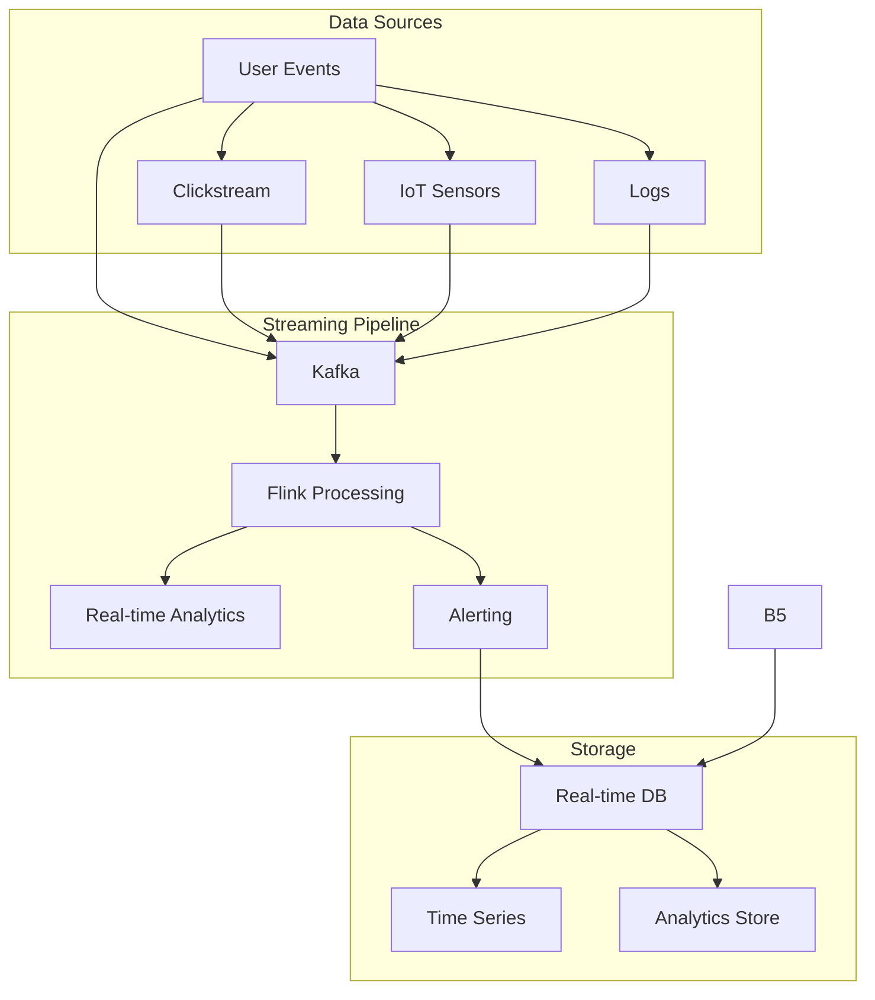

```python
# Pattern 1: Producer Kafka
from kafka import KafkaProducer
import json

class DataProducer:
    def __init__(self, bootstrap_servers):
        self.producer = KafkaProducer(
            bootstrap_servers=bootstrap_servers,
            value_serializer=lambda v: json.dumps(v).encode('utf-8')
        )
    
    def send_event(self, topic, event):
        future = self.producer.send(topic, event)
        future.add_callback(self.on_send_success)
        future.add_errback(self.on_send_error)
    
    def on_send_success(self, record_metadata):
        print(f"Message sent to {record_metadata.topic} partition {record_metadata.partition}")
    
    def on_send_error(self, excp):
        print(f"Failed to send message: {excp}")

# Pattern 2: Consumer Flink
from pyflink.datastream import StreamExecutionEnvironment
from pyflink.table import StreamTableEnvironment

def create_flink_job():
    env = StreamExecutionEnvironment.get_execution_environment()
    t_env = StreamTableEnvironment.create(env)
    
    # Créer la table source depuis Kafka
    source_ddl = """
        CREATE TABLE events (
            user_id STRING,
            event_type STRING,
            timestamp TIMESTAMP(3),
            properties STRING
        ) WITH (
            'connector' = 'kafka',
            'topic' = 'user-events',
            'properties.bootstrap.servers' = 'localhost:9092',
            'properties.group.id' = 'flink-consumer',
            'format' = 'json'
        )
    """
    
    t_env.execute_sql(source_ddl)
    
    # Requête SQL pour traiter les événements
    result = t_env.sql_query("""
        SELECT 
            user_id,
            event_type,
            COUNT(*) as event_count,
            TUMBLE_END(timestamp, INTERVAL '1' HOUR) as window_end
        FROM events
        GROUP BY user_id, event_type, TUMBLE(timestamp, INTERVAL '1' HOUR)
    """)
    
    return result
```

### Jour 13-14 : Projet 3 - Orchestration avec Airflow + DBT

**Pipeline Airflow Complet**

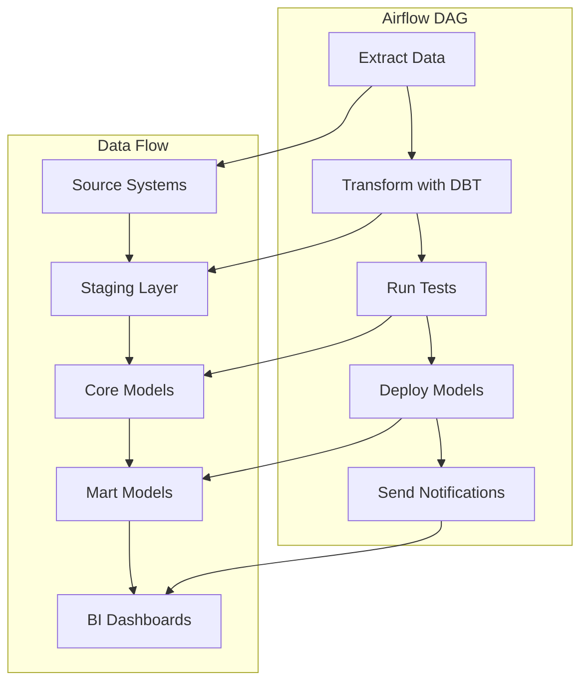

```python
# Pattern 1: DAG Airflow avec bonnes pratiques
from airflow import DAG
from airflow.operators.python import PythonOperator
from airflow.operators.bash import BashOperator
from airflow.providers.amazon.aws.operators.glue import AwsGlueJobOperator
from datetime import datetime, timedelta

default_args = {
    'owner': 'data-engineering-team',
    'depends_on_past': False,
    'start_date': datetime(2024, 1, 1),
    'email_on_failure': True,
    'email_on_retry': False,
    'retries': 3,
    'retry_delay': timedelta(minutes=5),
}

dag = DAG(
    'data_pipeline_daily',
    default_args=default_args,
    description='Pipeline quotidien de données',
    schedule_interval='0 2 * * *',  # Tous les jours à 2h du matin
    catchup=False,
    tags=['data-engineering', 'daily-pipeline']
)

# Task 1: Extraction des données
extract_task = PythonOperator(
    task_id='extract_data',
    python_callable=extract_data_from_sources,
    dag=dag
)

# Task 2: Transformation avec DBT
dbt_run_task = BashOperator(
    task_id='run_dbt_models',
    bash_command='cd /opt/airflow/dbt && dbt run --profiles-dir .',
    dag=dag
)

# Task 3: Tests de qualité
dbt_test_task = BashOperator(
    task_id='run_dbt_tests',
    bash_command='cd /opt/airflow/dbt && dbt test --profiles-dir .',
    dag=dag
)

# Task 4: Déploiement des modèles
deploy_task = PythonOperator(
    task_id='deploy_models',
    python_callable=deploy_models_to_production,
    dag=dag
)

# Définir les dépendances
extract_task >> dbt_run_task >> dbt_test_task >> deploy_task
```

**Modèles DBT**

```sql
-- Pattern 1: Modèle staging
-- models/staging/stg_orders.sql
WITH source AS (
    SELECT * FROM {{ source('raw_data', 'orders') }}
),

cleaned AS (
    SELECT
        order_id,
        user_id,
        order_date,
        amount,
        status,
        -- Nettoyage des données
        CASE 
            WHEN amount < 0 THEN 0 
            ELSE amount 
        END as cleaned_amount,
        -- Validation des dates
        CASE 
            WHEN order_date > CURRENT_DATE THEN CURRENT_DATE
            ELSE order_date
        END as valid_order_date
    FROM source
    WHERE order_id IS NOT NULL
)

SELECT * FROM cleaned

-- Pattern 2: Modèle mart business
-- models/marts/fct_daily_sales.sql
WITH daily_sales AS (
    SELECT
        DATE(valid_order_date) as sale_date,
        COUNT(*) as order_count,
        SUM(cleaned_amount) as total_revenue,
        AVG(cleaned_amount) as avg_order_value,
        COUNT(DISTINCT user_id) as unique_customers
    FROM {{ ref('stg_orders') }}
    GROUP BY DATE(valid_order_date)
),

daily_metrics AS (
    SELECT
        sale_date,
        order_count,
        total_revenue,
        avg_order_value,
        unique_customers,
        -- Calculs business
        total_revenue / NULLIF(unique_customers, 0) as revenue_per_customer,
        LAG(total_revenue, 1) OVER (ORDER BY sale_date) as prev_day_revenue,
        (total_revenue - LAG(total_revenue, 1) OVER (ORDER BY sale_date)) / 
        NULLIF(LAG(total_revenue, 1) OVER (ORDER BY sale_date), 0) * 100 as revenue_growth_pct
    FROM daily_sales
)

SELECT * FROM daily_metrics
```

---

## 📥 **Ingestion des Données - Fondations de l'Architecture Data**

### **Types de Données et Stratégies d'Ingestion**

L'ingestion des données constitue la première étape critique de tout pipeline data engineering. Cette étape détermine non seulement la qualité des données qui entrent dans votre système, mais aussi la performance globale de l'architecture. Comprendre les différents types de données et leurs caractéristiques est essentiel pour choisir les bonnes stratégies d'ingestion.

Les données transactionnelles (OLTP) représentent le cœur opérationnel des entreprises. Ces données sont générées en continu par les systèmes métiers : commandes e-commerce, transactions bancaires, logs utilisateurs, et interactions CRM. Leur caractéristique principale est la vélocité élevée - elles arrivent en temps réel ou quasi temps réel - mais avec des volumes relativement modérés. L'ingestion de ces données nécessite des outils capables de capturer les changements en continu sans impacter les performances des systèmes sources.

Les données analytiques (OLAP), en revanche, sont conçues pour l'analyse et le reporting. Elles sont généralement agrégées, historisées et optimisées pour les requêtes complexes. Ces données peuvent atteindre des volumes considérables, souvent plusieurs téraoctets par jour, mais leur vélocité est plus faible car elles sont traitées par batch. L'ingestion OLAP nécessite des stratégies différentes, souvent basées sur des processus ETL/ELT programmés.

### **Modes d'Ingestion : Batch vs Streaming**

Le choix entre l'ingestion par batch et en streaming n'est pas simplement technique, mais stratégique. Ce choix impacte la latence des données, les coûts d'infrastructure, la complexité opérationnelle, et finalement la valeur business que vous pouvez extraire de vos données.

L'ingestion par batch traite les données par lots à intervalles réguliers. Cette approche est économique pour les grands volumes car elle permet d'optimiser l'utilisation des ressources et de traiter les données de manière groupée. Le batch est idéal pour les rapports périodiques, les agrégations historiques, et les cas d'usage où la fraîcheur des données n'est pas critique. Cependant, la latence peut varier de quelques heures à plusieurs jours, ce qui limite la réactivité aux événements business.

L'ingestion en streaming, en revanche, traite les données au fil de l'eau, offrant une latence minimale souvent inférieure à la seconde. Cette approche est cruciale pour les cas d'usage où le temps est critique : détection de fraude en temps réel, recommandations personnalisées, monitoring d'infrastructure, et IoT. Le streaming permet une réaction immédiate aux événements, mais nécessite une infrastructure plus complexe et coûteuse, car elle doit fonctionner 24/7 avec une haute disponibilité.

L'architecture Lambda représente une approche hybride qui combine les avantages des deux modes. Elle maintient deux couches parallèles : une couche de vitesse (speed layer) pour le traitement en temps réel et une couche de batch pour le traitement complet et la réconciliation. Cette architecture offre la robustesse du batch avec la réactivité du streaming, mais au prix d'une complexité accrue et d'une maintenance double.

### **Outils et Technologies d'Ingestion**

Le choix des outils d'ingestion dépend de vos besoins spécifiques, de votre budget, et de l'expertise de votre équipe. Les outils CDC (Change Data Capture) comme Debezium, AWS DMS, et Oracle GoldenGate sont essentiels pour capturer les changements des bases de données transactionnelles sans impact sur les performances. Ces outils surveillent les logs de transaction et capturent uniquement les modifications, permettant une ingestion efficace et non-intrusive.

Pour les APIs et webhooks, des solutions comme Apache NiFi, Apache Airflow, et des services cloud natifs offrent une flexibilité maximale. Ces outils peuvent gérer l'authentification, la gestion des erreurs, le retry automatique, et la transformation des données en vol. Ils sont particulièrement adaptés aux intégrations avec des services tiers et des plateformes SaaS.

Les brokers de messages comme Apache Kafka, Apache Pulsar, et AWS Kinesis constituent l'épine dorsale des architectures de streaming. Ces systèmes offrent une durabilité des données, une scalabilité horizontale, et des garanties de livraison qui sont essentielles pour les applications critiques. Kafka, en particulier, est devenu le standard de facto pour les pipelines de streaming en raison de sa maturité, de sa performance, et de son écosystème riche.

## 💾 **Stockage des Données - Architectures et Stratégies**

### **Évolution des Paradigmes de Stockage**

Le stockage des données a connu une révolution majeure avec l'avènement du cloud computing et l'émergence de nouvelles technologies. Les organisations ne se contentent plus d'une base de données relationnelle unique ; elles ont besoin d'architectures hybrides qui combinent différents types de stockage selon les cas d'usage. Cette approche polyglotte permet d'optimiser les coûts, les performances, et la flexibilité.

Le Data Lake représente l'évolution naturelle du stockage traditionnel vers une approche plus flexible et économique. En stockant les données dans leur format brut sur des systèmes de fichiers distribués comme S3, Azure Data Lake, ou HDFS, les organisations peuvent ingérer rapidement de grandes quantités de données sans se soucier de leur structure. Cette approche est particulièrement précieuse dans les phases d'exploration où les besoins analytiques ne sont pas encore clairement définis.

Le Data Warehouse traditionnel, en revanche, maintient sa pertinence pour les cas d'usage analytiques bien définis. Les solutions cloud-native comme Snowflake, BigQuery, et Redshift ont révolutionné ce domaine en offrant une séparation entre le stockage et le calcul, permettant une scalabilité automatique et une facturation à l'usage. Cette approche élimine la nécessité de provisionner et maintenir des serveurs dédiés.

### **Formats de Fichiers et Optimisations**

Le choix des formats de fichiers est crucial pour les performances et les coûts de stockage. Les formats traditionnels comme CSV et JSON sont simples à utiliser mais inefficaces pour l'analytique à grande échelle. Les formats columnaires comme Parquet et ORC offrent des avantages significatifs en termes de compression et de performance de requête.

Parquet est devenu le format de référence pour l'analytique data lake. Sa structure columnaire permet une compression efficace et des requêtes rapides sur des colonnes spécifiques. Parquet supporte également des types de données complexes et l'évolution de schéma, ce qui est crucial pour les environnements de production où les structures de données évoluent constamment.

Les formats ACID comme Delta Lake, Iceberg, et Hudi représentent l'innovation la plus récente dans le domaine du stockage data lake. Ces formats ajoutent des garanties transactionnelles aux data lakes, permettant des opérations de mise à jour et de suppression sans compromettre la performance. Cette capacité est révolutionnaire car elle permet d'utiliser les data lakes pour des cas d'usage traditionnellement réservés aux data warehouses.

### **Stratégies de Partitionnement et Clustering**

Le partitionnement et le clustering sont des techniques essentielles pour optimiser les performances des requêtes sur de grandes quantités de données. Le partitionnement divise physiquement les données selon une ou plusieurs colonnes, généralement la date ou une région géographique. Cette approche permet aux moteurs de requête d'ignorer les partitions non pertinentes, réduisant drastiquement le temps de traitement.

Le clustering va au-delà du partitionnement en organisant les données au sein de chaque partition selon des colonnes fréquemment utilisées dans les clauses WHERE et JOIN. Cette organisation optimise l'utilisation des index et améliore les performances des requêtes complexes. Les solutions cloud comme Snowflake et BigQuery offrent des fonctionnalités de clustering automatique qui s'adaptent aux patterns d'usage.

La stratégie de partitionnement doit être soigneusement conçue en fonction des patterns de requête de votre application. Un partitionnement trop granulaire peut créer un grand nombre de petits fichiers, dégradant les performances. Un partitionnement trop grossier peut limiter l'efficacité du filtrage. La règle générale est de partitionner selon les colonnes les plus fréquemment utilisées dans les filtres, en visant des partitions de taille raisonnable (généralement entre 100MB et 1GB).

## ⚙️ **Processing et Transformation - Moteurs et Patterns**

### **Apache Spark : Le Moteur de Référence**

Apache Spark est devenu le moteur de traitement de données de référence pour les organisations qui traitent de grands volumes de données. Sa capacité à unifier le traitement par batch et en streaming, combinée à sa performance in-memory et son écosystème riche, en fait un choix naturel pour la plupart des cas d'usage data engineering. Cependant, Spark n'est pas une solution universelle et nécessite une compréhension approfondie de ses concepts fondamentaux pour être utilisé efficacement.

L'architecture de Spark repose sur le concept de RDD (Resilient Distributed Dataset), qui représente une collection distribuée d'objets qui peuvent être traités en parallèle. Cette abstraction permet à Spark de gérer automatiquement la distribution des données, la tolérance aux pannes, et l'optimisation des opérations. Les DataFrames et Datasets, introduits dans les versions récentes, offrent une API plus intuitive et des optimisations automatiques grâce au moteur Catalyst.

L'optimisation des performances Spark nécessite une compréhension profonde des concepts de partitionnement et de shuffle. Le partitionnement détermine comment les données sont distribuées entre les nœuds du cluster, impactant directement la parallélisation et l'utilisation des ressources. Le shuffle, en revanche, représente le mouvement de données entre les nœuds lors d'opérations comme les JOIN et les GROUP BY. Minimiser le shuffle est crucial pour les performances, car cette opération est coûteuse en termes de réseau et de disque.

### **Apache Flink : Le Streaming Natif**

Apache Flink représente l'évolution naturelle du streaming de données vers une approche plus sophistiquée et performante. Contrairement à Spark Streaming qui utilise un modèle de micro-batch, Flink traite les données de manière continue, offrant une latence minimale et des garanties de traitement exactement-une-fois. Cette approche native au streaming fait de Flink le choix privilégié pour les applications où la latence est critique.

L'architecture de Flink repose sur le concept de stream processing, où toutes les données sont traitées comme des flux continus. Cette approche unifie le traitement par batch et en streaming, simplifiant le développement et la maintenance. Flink gère automatiquement l'état des applications, permettant des calculs complexes comme les fenêtres glissantes, les agrégations temporelles, et les patterns de détection d'événements complexes.

La gestion de l'état est l'un des aspects les plus sophistiqués de Flink. Contrairement aux systèmes stateless qui traitent chaque événement indépendamment, Flink permet de maintenir un état persistant entre les événements. Cette capacité est cruciale pour des cas d'usage comme la détection de fraude, où il faut maintenir un historique des transactions d'un utilisateur, ou les recommandations en temps réel, où il faut maintenir un profil utilisateur à jour.

### **DBT : La Transformation SQL-First**

DBT (Data Build Tool) représente une approche révolutionnaire à la transformation des données qui place SQL au centre du processus. Contrairement aux outils ETL traditionnels qui nécessitent du code Python ou Java, DBT permet aux data analysts et engineers de transformer les données en utilisant uniquement SQL. Cette approche démocratise la transformation des données et améliore la collaboration entre les équipes techniques et métier.

L'architecture de DBT repose sur le concept de modèles SQL qui sont organisés en couches logiques : staging, intermediate, et marts. Les modèles staging nettoient et valident les données brutes, les modèles intermediate effectuent les transformations complexes et les jointures, et les modèles marts créent les vues business-ready pour l'analytique. Cette organisation hiérarchique facilite la maintenance et la compréhension des transformations.

La gestion des dépendances est l'un des points forts de DBT. Chaque modèle peut référencer d'autres modèles, créant un graphe de dépendances que DBT utilise pour déterminer l'ordre d'exécution optimal. Cette approche élimine la nécessité de gérer manuellement l'ordre des transformations et garantit que les modèles sont toujours exécutés dans le bon ordre.

### **Patterns d'Architecture Avancés**

L'architecture Lambda représente une approche hybride qui combine le meilleur du batch et du streaming. Elle maintient deux couches parallèles : une couche de vitesse (speed layer) qui traite les données en temps réel avec une latence minimale, et une couche de batch qui effectue un traitement complet et précis des données. Les résultats des deux couches sont ensuite fusionnés dans une couche de service (serving layer) qui fournit une vue unifiée aux utilisateurs.

L'architecture Kappa, en revanche, adopte une approche plus radicale en traitant toutes les données comme des streams. Cette approche élimine la duplication de logique entre les couches batch et streaming, simplifiant la maintenance et réduisant les risques d'incohérences. Cependant, l'architecture Kappa nécessite des outils de streaming sophistiqués et peut être plus complexe à déboguer et à tester.

L'architecture Data Mesh représente une évolution conceptuelle majeure qui traite les données comme des produits plutôt que comme des ressources techniques. Dans cette approche, chaque domaine métier est responsable de ses propres données et expose des APIs pour les partager avec d'autres domaines. Cette architecture améliore la scalabilité et l'agilité, mais nécessite une transformation organisationnelle significative.

## 💰 **Optimisation des Coûts et Gestion des Performances**

### **Stratégies d'Optimisation des Coûts**

L'optimisation des coûts dans les architectures data engineering n'est pas simplement une question de réduction des dépenses, mais une stratégie globale qui impacte la performance, la scalabilité, et la durabilité de votre infrastructure. Les coûts dans le cloud peuvent rapidement devenir incontrôlables si vous ne mettez pas en place des stratégies d'optimisation dès la conception de votre architecture.

La séparation du stockage et du calcul est l'un des principes fondamentaux de l'optimisation des coûts. Les solutions cloud-native comme Snowflake, BigQuery, et Redshift permettent de facturer séparément le stockage et le calcul, vous donnant la flexibilité de dimensionner chaque composant selon vos besoins. Cette approche est particulièrement efficace pour les charges de travail analytiques qui ont des pics d'utilisation prévisibles.

L'utilisation d'instances Spot et de politiques d'auto-scaling peut réduire drastiquement vos coûts de calcul. Les instances Spot sont des ressources cloud non utilisées vendues à prix réduit (généralement 70-90% moins chères que les instances on-demand). Bien que ces instances puissent être récupérées par le cloud provider avec un préavis court, elles sont parfaites pour les charges de travail batch qui peuvent tolérer des interruptions.

### **Monitoring et Observabilité**

Le monitoring et l'observabilité sont essentiels pour identifier les goulots d'étranglement et optimiser les performances de vos pipelines. Sans une visibilité complète sur l'exécution de vos jobs, l'optimisation reste un exercice de devinettes qui peut aggraver les problèmes au lieu de les résoudre.

Les métriques de performance doivent couvrir tous les aspects de vos pipelines : latence d'ingestion, temps de traitement, utilisation des ressources, et qualité des données. Ces métriques doivent être collectées en temps réel et présentées dans des dashboards qui permettent aux équipes d'identifier rapidement les problèmes et de prendre des décisions éclairées.

L'alerting intelligent va au-delà de la simple notification d'erreurs. Il doit inclure des alertes basées sur des seuils de performance, des tendances de dégradation, et des anomalies dans les patterns d'usage. Ces alertes doivent être configurées pour éviter le bruit tout en garantissant que les problèmes critiques sont détectés rapidement.

### **Gestion de la Qualité des Données**

La qualité des données est un aspect souvent négligé mais crucial de l'ingénierie des données. Des données de mauvaise qualité peuvent conduire à des analyses erronées, des décisions business incorrectes, et une perte de confiance dans l'infrastructure data. La mise en place de processus de validation et de monitoring de la qualité des données doit être une priorité dès la conception de vos pipelines.

Les tests de qualité des données doivent être automatisés et intégrés dans vos pipelines CI/CD. Ces tests doivent vérifier la complétude, l'exactitude, la cohérence, et la validité des données à chaque étape du pipeline. Des outils comme Great Expectations, Deequ, ou les tests intégrés de DBT peuvent automatiser ces vérifications et alerter les équipes en cas de problème.

La gouvernance des données est un aspect organisationnel qui complète les aspects techniques de la qualité. Elle inclut la documentation des sources de données, la définition de métadonnées, et l'établissement de processus de résolution des problèmes de qualité. Une gouvernance efficace améliore la collaboration entre les équipes et facilite la maintenance des pipelines.

## 🎯 **Scénarios de Pipeline Complets - Tous les Cas d'Usage**

### **1. Pipeline ETL Batch Classique**

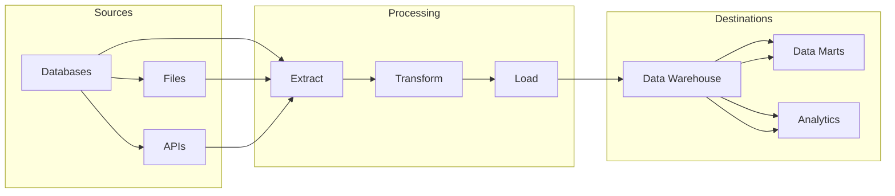

**Technologies :** Apache Airflow + DBT + Snowflake/Redshift
**Fréquence :** Quotidienne (batch)
**Cas d'usage :** Reporting business, analytics historiques, data marts

### **2. Pipeline Streaming Temps Réel**

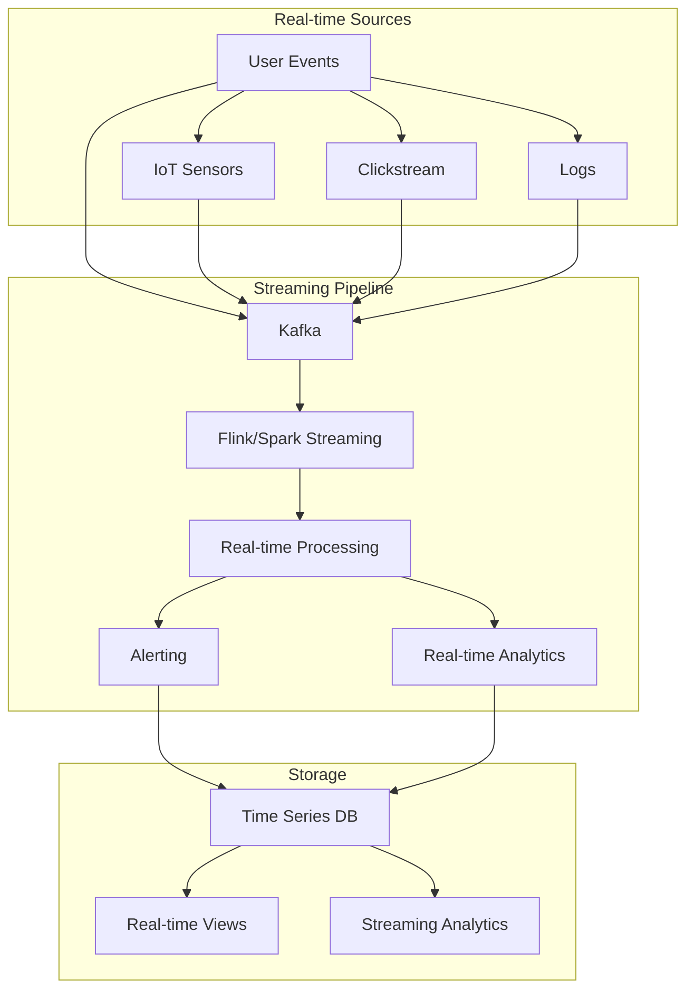

**Technologies :** Apache Kafka + Apache Flink + ClickHouse/TimescaleDB
**Fréquence :** Temps réel (millisecondes)
**Cas d'usage :** Détection fraude, monitoring IoT, analytics temps réel

### **3. Pipeline Lambda (Hybride)**

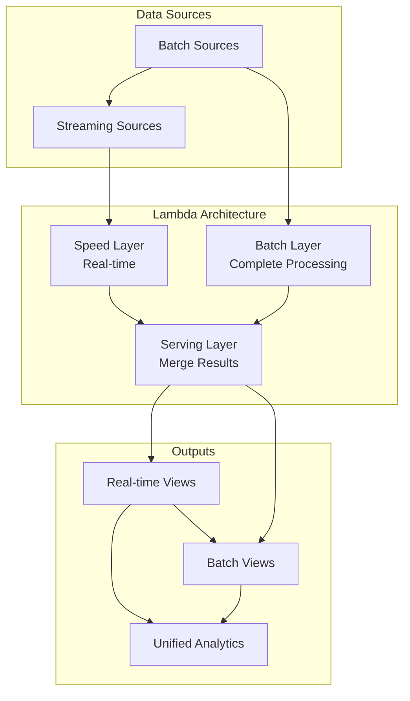

**Technologies :** Kafka + Flink (Speed) + Spark (Batch) + Serving Layer
**Fréquence :** Hybride (temps réel + batch)
**Cas d'usage :** Analytics unifiés, réconciliation temps réel/batch

### **4. Pipeline Data Lakehouse**

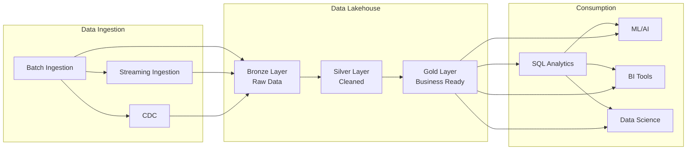

**Technologies :** Delta Lake + Apache Spark + Databricks
**Fréquence :** Continu + batch
**Cas d'usage :** Data science, ML pipelines, analytics unifiés

### **5. Pipeline IoT/Edge Computing**

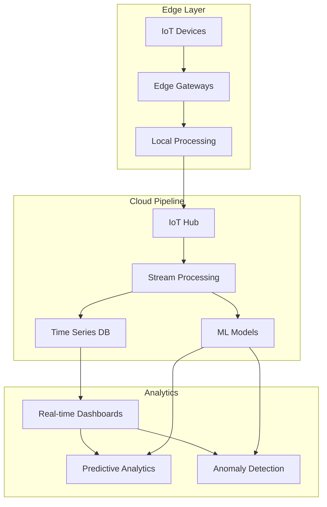

**Technologies :** Azure IoT Edge + Azure IoT Hub + Time Series Insights
**Fréquence :** Continu + batch
**Cas d'usage :** Manufacturing, smart cities, predictive maintenance

### **6. Pipeline ML/AI**

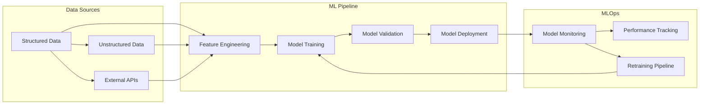

**Technologies :** MLflow + Kubeflow + SageMaker/Databricks
**Fréquence :** Continu + batch
**Cas d'usage :** Recommandations, prédictions, NLP, computer vision

### **7. Pipeline Data Mesh**

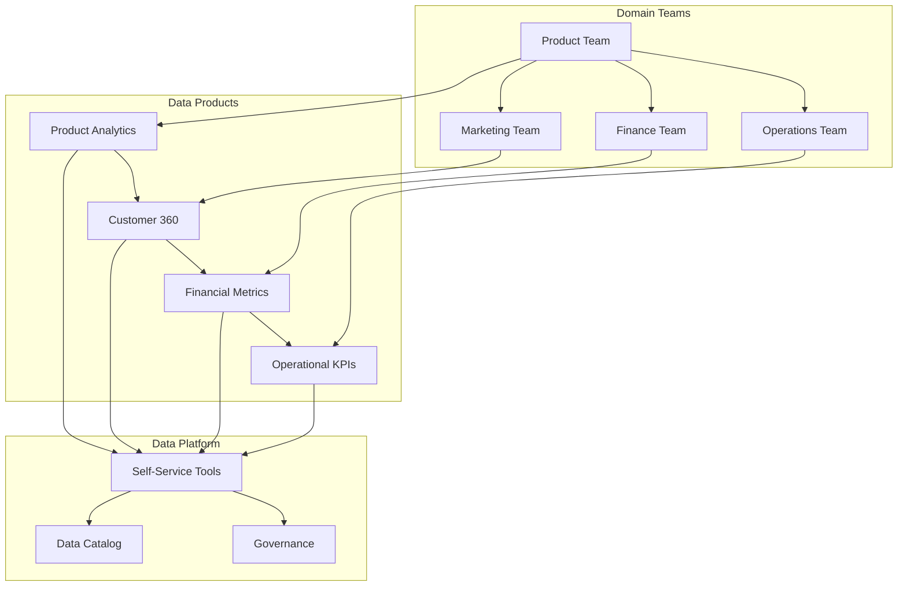

**Technologies :** Data Catalog + Self-service tools + Domain-driven design
**Fréquence :** Continu + batch
**Cas d'usage :** Organisations décentralisées, data democratization

### **8. Pipeline Event Sourcing + CQRS**

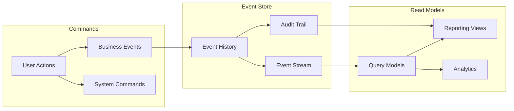

**Technologies :** EventStore + Apache Kafka + CQRS Framework
**Fréquence :** Temps réel + batch
**Cas d'usage :** Systèmes financiers, e-commerce, audit complet

### **9. Pipeline Real-time Analytics**

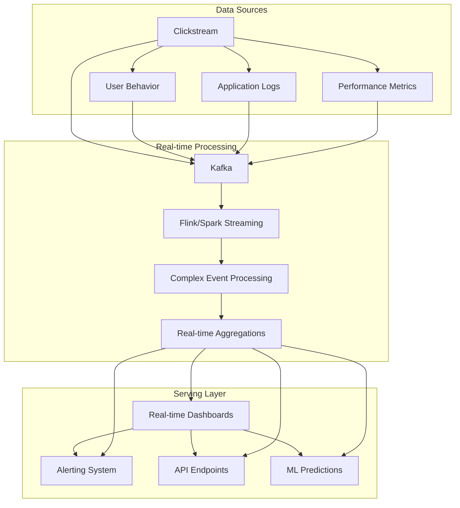

**Technologies :** Apache Kafka + Apache Flink + Redis + Grafana
**Fréquence :** Temps réel (millisecondes)
**Cas d'usage :** Monitoring application, user analytics, fraud detection

### **10. Pipeline Data Quality & Governance**

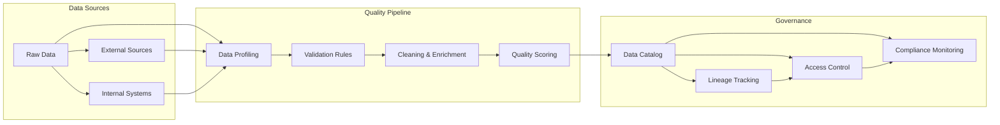

**Technologies :** Great Expectations + Apache Atlas + DataHub
**Fréquence :** Continu + batch
**Cas d'usage :** Data governance, compliance, quality assurance

### **11. Pipeline Multi-Cloud & Hybrid**

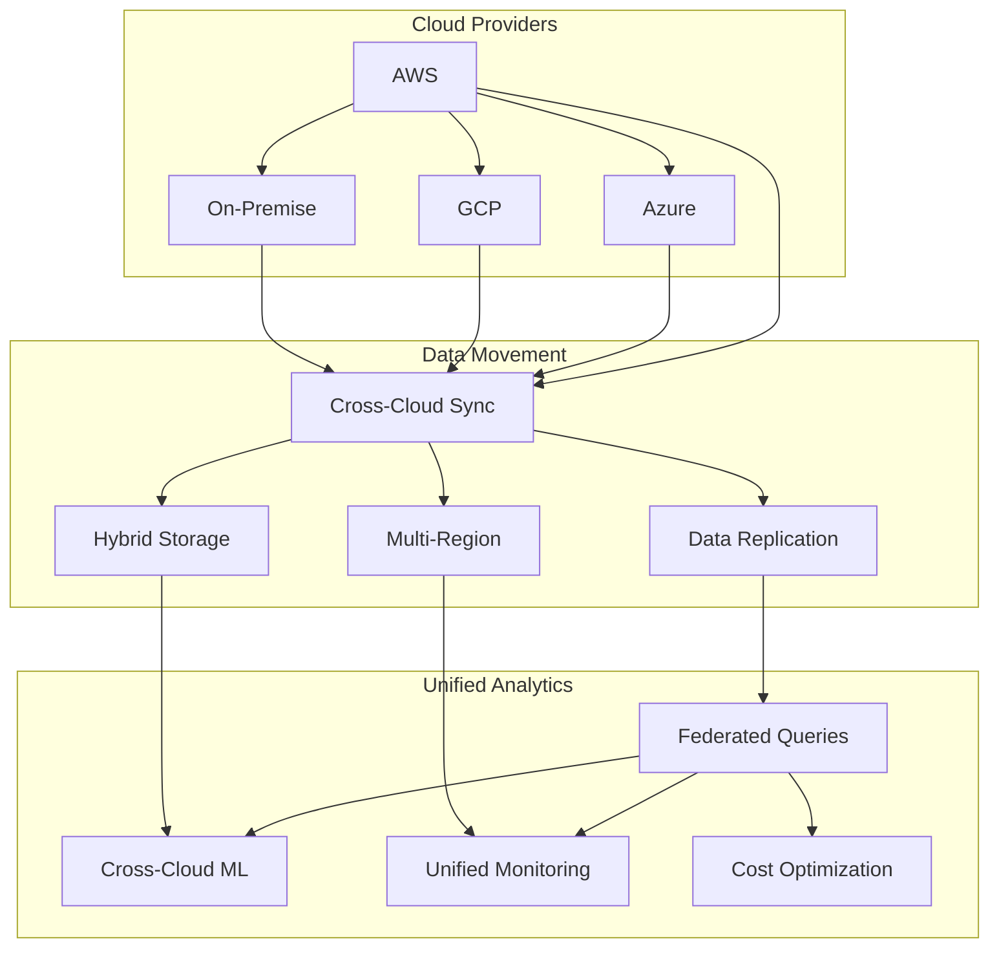

**Technologies :** Apache Airflow + Terraform + Multi-cloud SDKs
**Fréquence :** Continu + batch
**Cas d'usage :** Multi-cloud strategies, disaster recovery, cost optimization

### **12. Pipeline Data Monetization**

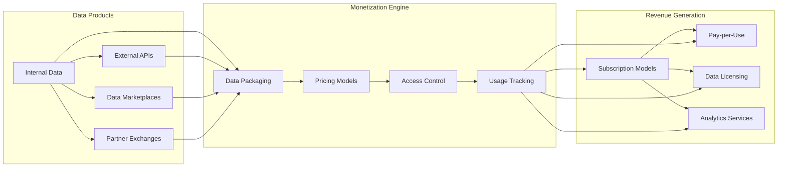

**Technologies :** Data Catalog + API Gateway + Billing Systems
**Fréquence :** Continu + batch
**Cas d'usage :** Data as a Service, external data products, revenue generation

### **13. Pipeline Regulatory Compliance**

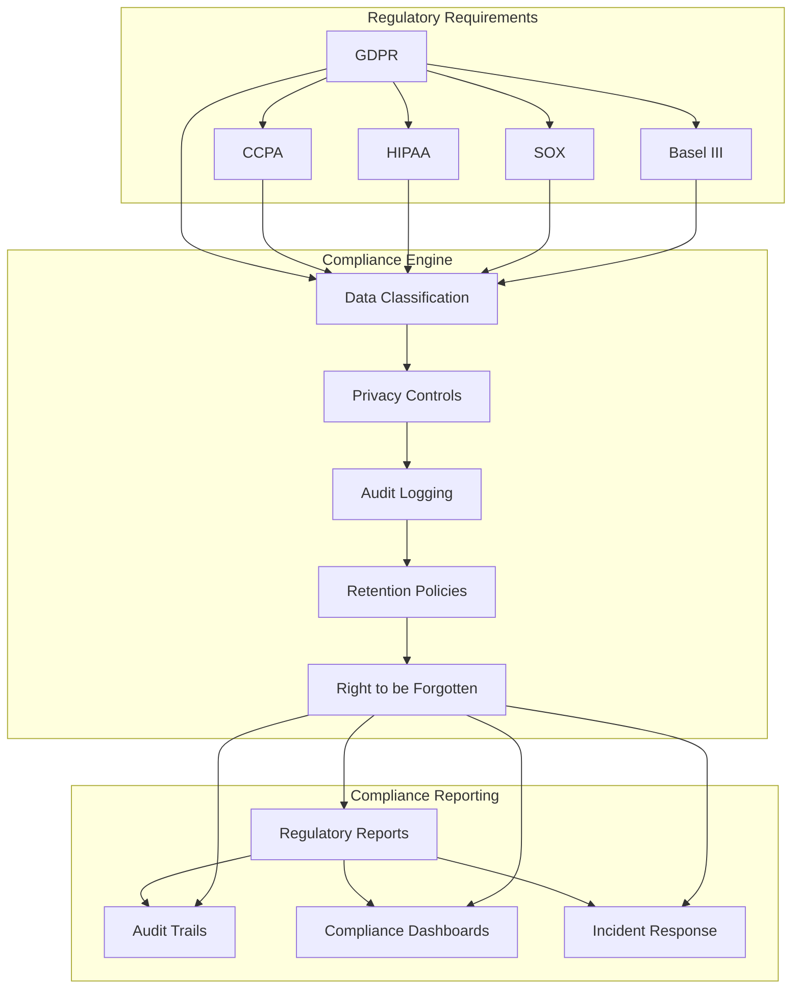

**Technologies :** Apache Atlas + Data Governance Tools + Compliance Frameworks
**Fréquence :** Continu + batch
**Cas d'usage :** Regulatory compliance, data privacy, audit requirements

### **14. Pipeline Data Science & Research**

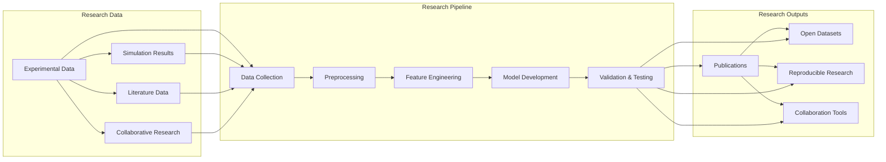

**Technologies :** Jupyter + MLflow + DVC + Research Platforms
**Fréquence :** Continu + batch
**Cas d'usage :** Academic research, R&D, collaborative science

### **15. Pipeline Data Engineering for Startups**

```mermaid
graph TB
    subgraph "Startup Constraints"
        A1[Limited Budget] --> A2[Small Team]
        A1 --> A3[Rapid Iteration]
        A1 --> A4[Uncertain Requirements]
    end
    
    subgraph "Startup-Optimized Pipeline"
        B1[Open Source Tools] --> B2[Cloud-Native Services]
        B2 --> B3[Serverless Architecture]
        B3 --> B4[Auto-scaling]
        B4 --> B5[Cost Monitoring]
    end
    
    subgraph "Growth Enablers"
        C1[Quick Prototyping] --> C2[Scalable Foundation]
        C1 --> C3[Data-Driven Decisions]
        C1 --> C4[Investor Reporting]
    end
    
    A1 --> B1
    A2 --> B1
    A3 --> B1
    A4 --> B1
    B5 --> C1
    B5 --> C2
    B5 --> C3
    B5 --> C4
```

**Technologies :** PostgreSQL + Python + Cloud Services + Open Source Tools
**Fréquence :** Batch + incremental
**Cas d'usage :** MVP development, rapid scaling, cost optimization

---

## 🚀 **Structure Hiérarchique des 6 Niveaux**

### **Niveau 1 : Fondamentaux Data Engineering** ✅
**Ce que vous venez de maîtriser :**
- Python avancé pour la data (structures, Pandas, générateurs)
- SQL mastery (Window Functions, CTEs, optimisation)
- Architecture cloud (Data Lake, Warehouse, Lakehouse)
- 15 scénarios de pipeline complets avec graphiques Mermaid
- Bonnes pratiques (sécurité, conformité, opérations)

### **Niveau 2 : Modélisation & Architecture Avancée** 🔄
**Prochaines étapes :**
- Modélisation dimensionnelle avancée (Star Schema, Snowflake, Data Vault)
- Architecture patterns complexes (Microservices, Event-Driven, Domain-Driven)
- Performance tuning et optimisation avancée
- Gestion des métadonnées et data lineage
- Architecture multi-tenant et multi-region

### **Niveau 3 : Scénarios Complexes & Solutions sur Mesure** 📋
**Cas d'usage avancés :**
- Pipelines pour secteurs réglementés (Finance, Santé, Aviation)
- Architectures hybrides on-premise/cloud
- Gestion des données non-structurées (images, vidéos, documents)
- Intégration avec systèmes legacy et mainframes
- Solutions pour entreprises multinationales

### **Niveau 4 : Pipelines Transactionnels & Temps Réel** ⚡
**Streaming et temps réel :**
- Architectures streaming complexes (Kappa, Lambda avancé)
- Gestion des états distribués et de la cohérence
- Pipelines pour trading financier et gaming
- IoT et edge computing avancés
- Real-time ML et recommandations

### **Niveau 5 : Préparation Entretiens & Tests Techniques** 🎯
**Exercices pratiques complets :**
- **SQL Avancé** : 20 exercices avec contexte business et corrections
- **Python Data Engineering** : 15 problèmes avec solutions détaillées
- **Pipeline Design** : 10 scénarios d'architecture avec évaluations
- **Questions d'entretien** : 50 questions types avec réponses modèles
- **Tests techniques** : Simulations d'entretiens complets

### **Niveau 6 : Carrière & Développement Professionnel** 🚀
**Évolution professionnelle :**
- Roadmap de carrière (Junior → Senior → Lead → Architect)
- Spécialisations (Cloud, Streaming, ML, Governance)
- Certifications recommandées par niveau
- Networking et communauté data engineering
- Freelancing et consulting
- Création d'entreprise dans la data

## 🎯 **Bonnes Pratiques et Checklist de Validation**

### **Design et Architecture**

La conception d'une architecture data engineering robuste commence par la définition claire des objectifs business et des contraintes techniques. Chaque décision architecturale doit être justifiée par des besoins métier spécifiques plutôt que par des préférences technologiques. L'architecture doit être conçue pour évoluer et s'adapter aux changements futurs, évitant les solutions qui créent des dépendances rigides.

L'idempotence est un principe fondamental qui garantit que l'exécution multiple d'une même opération produit le même résultat. Cette propriété est cruciale pour la fiabilité des pipelines, car elle permet de rejouer des jobs en cas d'échec sans créer de duplications ou d'incohérences. L'implémentation de l'idempotence nécessite une conception soigneuse des clés de traitement et des mécanismes de déduplication.

L'évolution des schémas de données est inévitable dans les environnements de production. Votre architecture doit supporter les changements de structure sans nécessiter de reconstructions complètes des données. Des formats comme Parquet, Avro, et Delta Lake offrent des mécanismes natifs pour l'évolution de schéma, permettant aux équipes d'itérer rapidement sur leurs modèles de données.

### **Sécurité et Conformité**

La sécurité des données est un aspect critique qui doit être intégré dès la conception de votre architecture. Le chiffrement des données au repos et en transit est un minimum absolu, mais une stratégie de sécurité complète inclut également la gestion des identités et des accès, la surveillance des activités, et la protection contre les menaces internes et externes.

La conformité réglementaire (GDPR, CCPA, HIPAA, etc.) impose des exigences spécifiques sur la collecte, le traitement, et le stockage des données personnelles. Votre architecture doit inclure des mécanismes pour la pseudonymisation, le droit à l'oubli, et la traçabilité des accès aux données. Ces exigences ne sont pas des contraintes techniques mais des opportunités de construire une architecture plus robuste et éthique.

L'audit et la traçabilité sont essentiels pour la conformité et la sécurité. Tous les accès aux données, les modifications, et les exécutions de pipelines doivent être enregistrés et conservés pour des périodes appropriées. Ces logs permettent non seulement de détecter les activités suspectes mais aussi de diagnostiquer les problèmes et d'optimiser les performances.

### **Opérations et Maintenance**

L'automatisation des opérations est cruciale pour maintenir la fiabilité et l'efficacité de votre infrastructure data. Les pipelines CI/CD automatisent le déploiement des changements, réduisant les erreurs humaines et accélérant le time-to-market. L'automatisation des tests garantit que chaque modification est validée avant d'être déployée en production.

La gestion des incidents et la récupération après sinistre doivent être planifiées et testées régulièrement. Votre architecture doit inclure des mécanismes de failover automatique, des sauvegardes régulières, et des procédures de restauration documentées. Ces mécanismes ne sont pas des luxes mais des nécessités pour maintenir la continuité des services.

Le monitoring proactif va au-delà de la simple surveillance des métriques. Il inclut la détection des anomalies, la prédiction des problèmes avant qu'ils n'impactent les utilisateurs, et l'optimisation continue des performances. Des outils comme Prometheus, Grafana, et Datadog fournissent la visibilité nécessaire pour maintenir une infrastructure data performante et fiable.

---

## 🚀 **Conclusion et Prochaines Étapes**

Ce guide couvre les fondations essentielles de l'ingénierie des données, mais le voyage ne s'arrête pas là. L'ingénierie des données est un domaine en constante évolution, avec de nouvelles technologies et approches qui émergent régulièrement. Votre apprentissage doit être continu, basé sur l'expérience pratique et l'expérimentation avec de nouveaux outils et patterns.

La construction d'un portfolio de projets concrets est la meilleure façon de consolider vos compétences et de démontrer votre expertise. Chaque projet doit être documenté, versionné, et déployé dans un environnement de production ou de démonstration. Ces projets constituent votre preuve de compétence et vous permettent d'itérer et d'améliorer vos compétences.

L'engagement avec la communauté data engineering est également crucial pour votre développement professionnel. Participez aux conférences, contribuez aux projets open source, et partagez vos expériences avec d'autres praticiens. Cette collaboration enrichit non seulement votre propre apprentissage mais contribue également à l'évolution du domaine.

**Rappel** : Chaque concept doit être immédiatement appliqué dans un projet. Codez, testez, déployez, documentez. C'est ainsi que vous construisez un portfolio qui parle plus fort que les mots ! 💪
