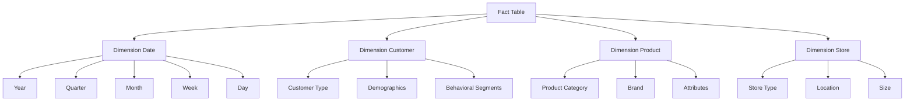
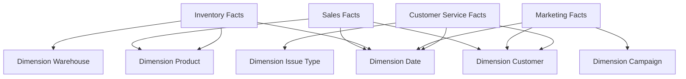
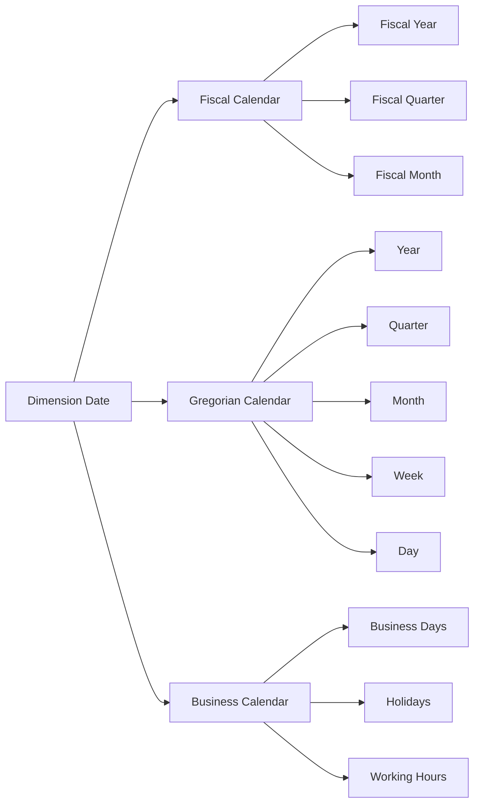
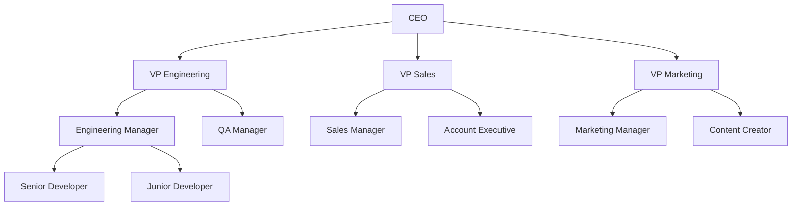
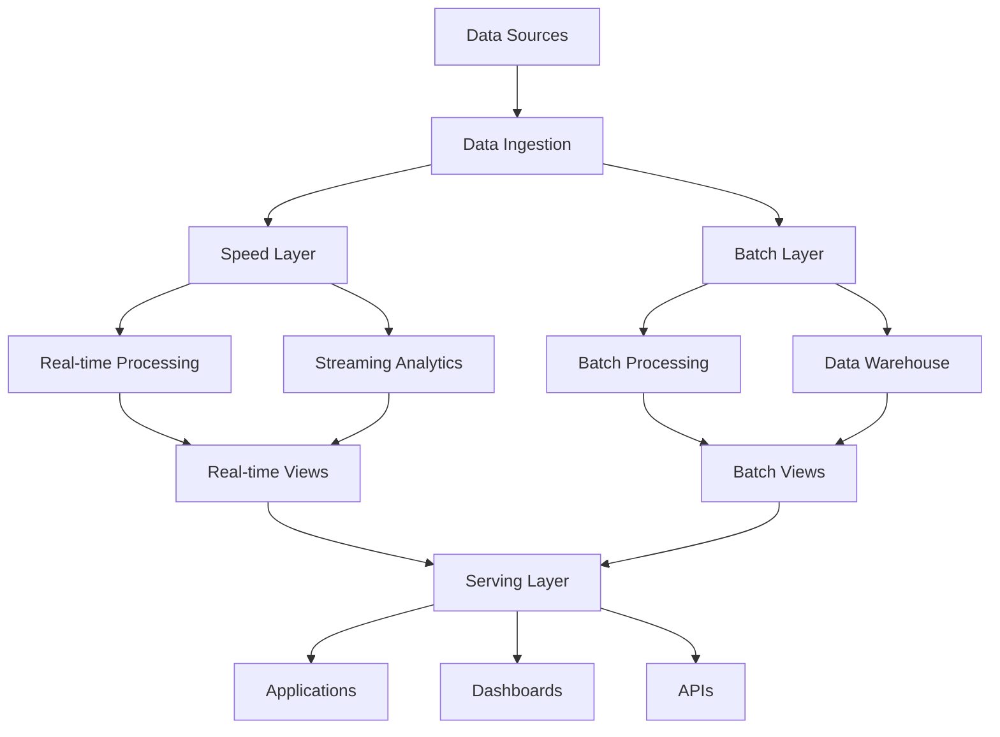
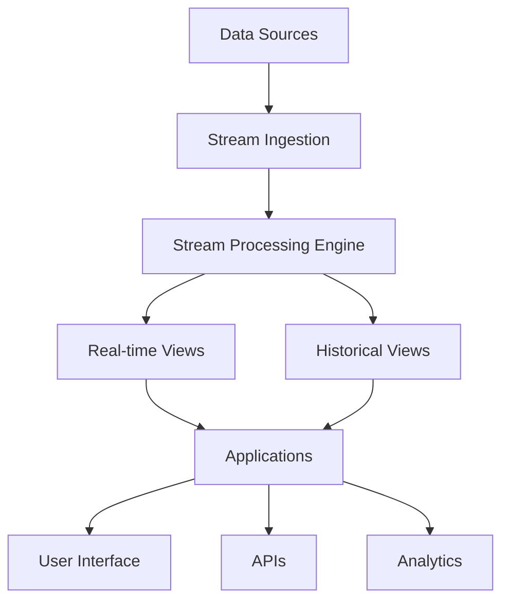
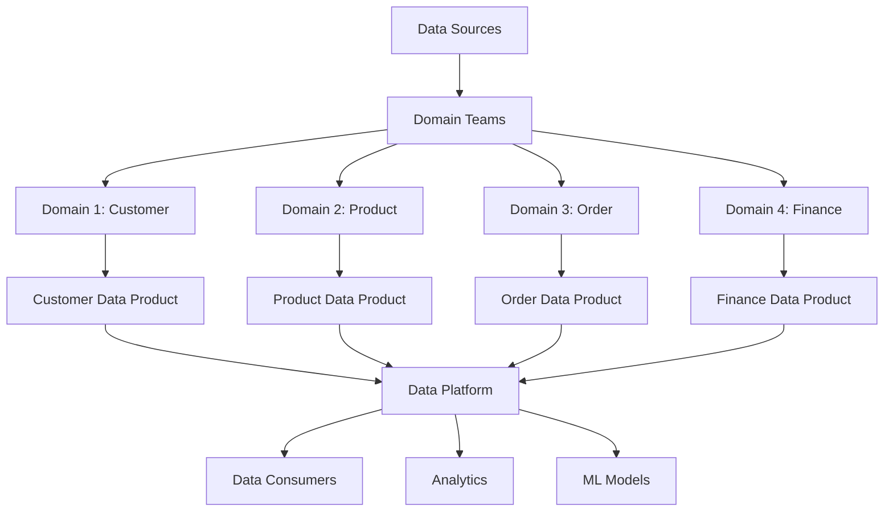
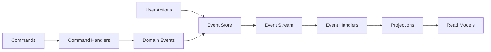

# Niveau 2 : Modélisation et Architecture Avancée des Données

## Objectifs d'Apprentissage
- Maîtriser les concepts avancés de modélisation des données
- Concevoir des architectures de données robustes et évolutives
- Implémenter des patterns de conception pour les pipelines de données
- Optimiser les performances et la qualité des données

## Durée Estimée
**4-6 semaines** (selon votre niveau et disponibilité)

## Niveau Requis
**Intermédiaire** - Avoir validé le Niveau 1 ou équivalent

---

## 1. Modélisation des Données Avancée

### 1.1 Modèles Dimensionnels Avancés

La modélisation dimensionnelle va au-delà des concepts de base pour aborder des scénarios complexes et des optimisations avancées. Elle s'appuie sur des patterns éprouvés qui permettent de gérer la complexité tout en maintenant la performance.

#### Modèle en Étoile Étendu
Le modèle en étoile classique peut être étendu pour gérer des relations complexes et des hiérarchies multiples. Cette approche permet de maintenir la simplicité de requête tout en ajoutant de la flexibilité.



#### Modèle en Flocon (Snowflake)
Le modèle en flocon normalise les dimensions pour éliminer la redondance et améliorer la cohérence des données. Cette approche est particulièrement utile pour les dimensions avec de nombreuses hiérarchies.

**Avantages :**
- Réduction de la redondance des données
- Meilleure cohérence et maintenance
- Optimisation de l'espace de stockage
- Facilité de mise à jour des attributs

**Inconvénients :**
- Complexité accrue des requêtes
- Jointures multiples potentiellement coûteuses
- Risque de dégradation des performances

#### Modèle Constellation (Galaxy)
Le modèle constellation permet de partager des dimensions entre plusieurs tables de faits, créant un réseau interconnecté de données. Cette approche est idéale pour les entreprises avec plusieurs processus métier.



### 1.2 Modélisation des Données Temporelles

La gestion du temps dans les données est cruciale pour l'analyse historique et la prise de décision basée sur les tendances. Les modèles temporels permettent de capturer l'évolution des données dans le temps.

#### Tables de Faits Temporelles
Les tables de faits temporelles capturent les événements à des moments précis, permettant l'analyse des tendances et des patterns temporels.

**Types de Clés Temporelles :**
- **Date de Transaction** : Moment exact de l'événement
- **Date d'Effet** : Date à laquelle l'événement prend effet
- **Date de Fin** : Date de fin de validité
- **Date de Mise à Jour** : Dernière modification

#### Dimensions Temporelles Avancées
Les dimensions temporelles peuvent inclure des attributs complexes comme les saisons, les jours fériés, ou les événements spéciaux.



#### Gestion des Changements Lents (Slowly Changing Dimensions)
Les dimensions peuvent changer dans le temps, et il est important de gérer ces changements pour maintenir l'historique des données.

**Type 1 : Écrasement**
- L'ancienne valeur est remplacée par la nouvelle
- Pas de conservation de l'historique
- Utilisé pour les corrections d'erreurs

**Type 2 : Nouvelle Ligne**
- Une nouvelle ligne est créée avec la nouvelle valeur
- L'ancienne ligne est conservée avec une date de fin
- Permet de conserver l'historique complet

**Type 3 : Colonnes Supplémentaires**
- Ajout de colonnes pour stocker les valeurs précédentes
- Limite le nombre de versions historiques
- Compromis entre performance et historique

### 1.3 Modélisation des Données Hiérarchiques

Les hiérarchies sont omniprésentes dans les données métier et nécessitent une modélisation spécialisée pour une navigation efficace.

#### Hiérarchies Parent-Enfant
Les hiérarchies parent-enfant permettent de représenter des structures organisationnelles ou des taxonomies.



#### Hiérarchies Niveaux Fixes
Les hiérarchies avec un nombre fixe de niveaux sont plus simples à implémenter et à interroger.

**Exemple : Géographie**
- Niveau 1 : Continent
- Niveau 2 : Pays
- Niveau 3 : Région/État
- Niveau 4 : Ville
- Niveau 5 : Code Postal

#### Hiérarchies Recursives
Les hiérarchies récursives permettent de gérer des structures de profondeur variable.

**Implémentation avec Table de Référence :**
```sql
CREATE TABLE employee_hierarchy (
    employee_id INT PRIMARY KEY,
    employee_name VARCHAR(100),
    manager_id INT,
    level INT,
    path VARCHAR(255)
);

-- Remplir la table avec des données hiérarchiques
INSERT INTO employee_hierarchy VALUES
(1, 'CEO', NULL, 1, '1'),
(2, 'VP Engineering', 1, 2, '1.2'),
(3, 'Engineering Manager', 2, 3, '1.2.3'),
(4, 'Senior Developer', 3, 4, '1.2.3.4');
```

## 2. Architecture des Données Avancée

### 2.1 Patterns d'Architecture

Les patterns d'architecture fournissent des solutions éprouvées pour des problèmes récurrents dans la conception de systèmes de données.

#### Pattern Lambda
Le pattern Lambda sépare le traitement en deux voies : une pour le traitement en temps réel et une pour le traitement par lots.



**Avantages :**
- Gestion efficace des données en temps réel et par lots
- Tolérance aux pannes et récupération automatique
- Flexibilité dans le traitement des données
- Évolutivité horizontale

**Cas d'Usage :**
- Plateformes de trading en temps réel
- Systèmes de recommandation
- Monitoring d'infrastructure
- Analytics en temps réel

#### Pattern Kappa
Le pattern Kappa traite toutes les données comme des streams, éliminant la complexité du pattern Lambda.



**Avantages :**
- Simplicité conceptuelle
- Cohérence des données
- Facilité de maintenance
- Reproductibilité des résultats

**Cas d'Usage :**
- Systèmes de monitoring
- Analytics en temps réel
- IoT et capteurs
- Logs et événements

#### Pattern Data Mesh
Le pattern Data Mesh décentralise la propriété et la gouvernance des données, donnant plus d'autonomie aux équipes métier.



**Principes :**
- **Propriété des Données** : Chaque équipe métier possède ses données
- **Données comme Produit** : Les données sont traitées comme des produits avec des contrats clairs
- **Infrastructure Self-Service** : Plateforme centralisée pour l'infrastructure
- **Gouvernance Fédérée** : Règles communes avec autonomie locale

### 2.2 Architecture des Données Distribuées

Les architectures distribuées permettent de gérer de grandes quantités de données et d'assurer la haute disponibilité.

#### Partitionnement des Données
Le partitionnement divise les données en sections plus petites pour améliorer les performances et la maintenance.

**Partitionnement Horizontal (Sharding)**
- Division des données par lignes
- Chaque partition contient un sous-ensemble de lignes
- Améliore les performances de lecture/écriture

**Partitionnement Vertical**
- Division des données par colonnes
- Chaque partition contient un sous-ensemble de colonnes
- Réduit la taille des données transférées

**Stratégies de Partitionnement :**
- **Par Hash** : Distribution uniforme basée sur une fonction de hachage
- **Par Range** : Division basée sur des plages de valeurs
- **Par Liste** : Division basée sur des valeurs spécifiques
- **Par Temps** : Division basée sur des périodes temporelles

#### Réplication des Données
La réplication améliore la disponibilité et les performances en créant des copies des données.

**Types de Réplication :**
- **Réplication Synchrone** : Écriture simultanée sur tous les nœuds
- **Réplication Asynchrone** : Écriture différée sur les nœuds secondaires
- **Réplication Semi-Synchrone** : Écriture sur un sous-ensemble de nœuds

**Topologies de Réplication :**
- **Master-Slave** : Un nœud principal et plusieurs nœuds secondaires
- **Master-Master** : Plusieurs nœuds avec droits d'écriture
- **Ring** : Chaîne circulaire de nœuds
- **Star** : Nœud central avec connexions vers tous les autres

### 2.3 Architecture des Données en Temps Réel

Les architectures en temps réel permettent de traiter et d'analyser les données au moment où elles sont générées.

#### Streaming de Données
Le streaming traite les données en continu, permettant des analyses et des actions en temps réel.

**Composants du Streaming :**
- **Source de Données** : Génère ou capture les données
- **Broker de Messages** : Stocke temporairement les messages
- **Processeur de Stream** : Traite les données en continu
- **Sink de Données** : Stocke ou transmet les résultats

**Technologies de Streaming :**
- **Apache Kafka** : Broker de messages distribué
- **Apache Flink** : Moteur de traitement de streams
- **Apache Storm** : Traitement de streams en temps réel
- **Apache Spark Streaming** : Extension de Spark pour le streaming

#### Event Sourcing
L'Event Sourcing stocke tous les événements qui ont modifié l'état d'un système, permettant de reconstruire l'état à n'importe quel moment.



**Avantages :**
- Audit trail complet
- Débogage et diagnostic facilités
- Reproductibilité des états
- Évolutivité temporelle

**Cas d'Usage :**
- Systèmes bancaires
- Plateformes de trading
- Systèmes de réservation
- Gestion des stocks

## 3. Optimisation des Performances

### 3.1 Optimisation des Requêtes

L'optimisation des requêtes est cruciale pour maintenir de bonnes performances dans les systèmes de données.

#### Indexation Avancée
Les index améliorent significativement les performances de lecture en créant des structures de données optimisées.

**Types d'Index :**
- **Index B-tree** : Structure équilibrée pour les requêtes d'égalité et de plage
- **Index Hash** : Optimisé pour les requêtes d'égalité exacte
- **Index Bitmap** : Efficace pour les colonnes avec peu de valeurs distinctes
- **Index Composite** : Combine plusieurs colonnes pour des requêtes complexes

**Stratégies d'Indexation :**
- Indexer les colonnes fréquemment utilisées dans les clauses WHERE
- Créer des index composites pour les requêtes multi-colonnes
- Éviter la sur-indexation qui ralentit les écritures
- Monitorer l'utilisation des index pour identifier les optimisations

#### Partitionnement des Tables
Le partitionnement améliore les performances en divisant les grandes tables en sections plus petites.

**Avantages du Partitionnement :**
- Amélioration des performances de requête
- Maintenance plus facile (backup, restore, maintenance)
- Meilleure utilisation du cache
- Parallélisation des opérations

**Stratégies de Partitionnement :**
- **Partitionnement par Date** : Idéal pour les données temporelles
- **Partitionnement par ID** : Distribution uniforme des données
- **Partitionnement par Région** : Basé sur des critères géographiques
- **Partitionnement Composite** : Combinaison de plusieurs stratégies

### 3.2 Optimisation du Stockage

L'optimisation du stockage vise à réduire l'espace utilisé tout en maintenant les performances.

#### Compression des Données
La compression réduit l'espace de stockage et améliore les performances I/O.

**Types de Compression :**
- **Compression de Colonnes** : Optimisée pour les requêtes analytiques
- **Compression de Lignes** : Efficace pour les opérations OLTP
- **Compression Hybride** : Combine les avantages des deux approches

**Algorithmes de Compression :**
- **LZ77/LZ78** : Compression basée sur la répétition de motifs
- **Run-Length Encoding** : Efficace pour les données répétitives
- **Dictionary Compression** : Remplace les valeurs fréquentes par des références

#### Stratégies de Stockage
Les stratégies de stockage déterminent comment et où stocker les données pour optimiser les performances.

**Stockage Multi-Niveaux :**
- **Hot Storage** : Données fréquemment accédées (SSD, mémoire)
- **Warm Storage** : Données moyennement accédées (disques rapides)
- **Cold Storage** : Données rarement accédées (disques lents, cloud)

**Politiques de Rétention :**
- **Rétention Temporelle** : Suppression automatique après une période
- **Rétention par Volume** : Limitation de l'espace utilisé
- **Rétention par Critères** : Suppression basée sur des règles métier

### 3.3 Optimisation des Pipelines

L'optimisation des pipelines améliore l'efficacité du traitement des données.

#### Parallélisation
La parallélisation traite plusieurs tâches simultanément pour améliorer les performances.

**Niveaux de Parallélisation :**
- **Parallélisation de Données** : Division des données en partitions
- **Parallélisation de Tâches** : Exécution simultanée de tâches indépendantes
- **Parallélisation de Pipeline** : Exécution en cascade de tâches

**Techniques de Parallélisation :**
- **MapReduce** : Division en phases map et reduce
- **Fork-Join** : Division récursive des tâches
- **Pipeline** : Exécution en cascade avec buffers

#### Optimisation des Ressources
L'optimisation des ressources maximise l'utilisation des ressources disponibles.

**Gestion de la Mémoire :**
- **Pool de Mémoire** : Réutilisation des objets pour réduire le garbage collection
- **Cache Intelligents** : Mise en cache des données fréquemment accédées
- **Gestion des Fuites** : Détection et correction des fuites mémoire

**Optimisation CPU :**
- **Vectorisation** : Utilisation des instructions SIMD
- **Optimisation des Boucles** : Réduction des opérations redondantes
- **Compilation JIT** : Optimisation dynamique du code

## 4. Qualité et Gouvernance des Données

### 4.1 Qualité des Données

La qualité des données est fondamentale pour la fiabilité des analyses et des décisions métier.

#### Dimensions de la Qualité
La qualité des données peut être évaluée selon plusieurs dimensions.

**Exactitude :**
- Les données reflètent-elles la réalité ?
- Y a-t-il des erreurs de saisie ou de calcul ?
- Les données sont-elles cohérentes avec d'autres sources ?

**Complétude :**
- Toutes les données requises sont-elles présentes ?
- Y a-t-il des valeurs manquantes ?
- Les données couvrent-elles la période attendue ?

**Cohérence :**
- Les données sont-elles cohérentes entre elles ?
- Y a-t-il des contradictions ?
- Les formats sont-ils uniformes ?

**Actualité :**
- Les données sont-elles à jour ?
- Y a-t-il des délais de mise à jour ?
- La fréquence de mise à jour est-elle appropriée ?

#### Validation des Données
La validation vérifie que les données respectent les règles et contraintes définies.

**Types de Validation :**
- **Validation de Format** : Vérification de la structure des données
- **Validation de Contenu** : Vérification de la logique métier
- **Validation de Cohérence** : Vérification des relations entre données
- **Validation de Plage** : Vérification des valeurs acceptables

**Outils de Validation :**
- **Règles Métier** : Contraintes définies par les experts métier
- **Schémas de Données** : Définition de la structure attendue
- **Tests Automatisés** : Vérification automatique de la qualité
- **Monitoring Continu** : Surveillance en temps réel de la qualité

### 4.2 Gouvernance des Données

La gouvernance des données définit les politiques et procédures pour gérer les données de manière cohérente et sécurisée.

#### Cadre de Gouvernance
Le cadre de gouvernance établit la structure et les responsabilités pour la gestion des données.

**Composants du Cadre :**
- **Politiques** : Règles et directives pour la gestion des données
- **Procédures** : Processus détaillés pour l'application des politiques
- **Standards** : Spécifications techniques et métier
- **Métriques** : Indicateurs de performance et de qualité

**Rôles et Responsabilités :**
- **Data Steward** : Responsable de la qualité d'un domaine de données
- **Data Owner** : Propriétaire métier des données
- **Data Custodian** : Responsable technique de la gestion des données
- **Data Governance Council** : Comité de pilotage de la gouvernance

#### Classification des Données
La classification des données détermine le niveau de protection et de gestion requis.

**Niveaux de Classification :**
- **Publique** : Données accessibles à tous
- **Interne** : Données accessibles aux employés
- **Confidentiel** : Données sensibles nécessitant une protection
- **Restreint** : Données hautement sensibles avec accès limité

**Critères de Classification :**
- **Sensibilité** : Impact potentiel d'une divulgation
- **Réglementation** : Exigences légales et réglementaires
- **Valeur Métier** : Importance stratégique des données
- **Risque** : Probabilité et impact des menaces

### 4.3 Sécurité et Conformité

La sécurité et la conformité protègent les données contre les menaces et assurent le respect des réglementations.

#### Sécurité des Données
La sécurité protège les données contre l'accès non autorisé et les modifications.

**Contrôles d'Accès :**
- **Authentification** : Vérification de l'identité des utilisateurs
- **Autorisation** : Définition des permissions d'accès
- **Audit** : Enregistrement des accès et modifications
- **Chiffrement** : Protection des données sensibles

**Protection des Données :**
- **Chiffrement au Repos** : Protection des données stockées
- **Chiffrement en Transit** : Protection des données transmises
- **Masquage des Données** : Dissimulation des informations sensibles
- **Anonymisation** : Suppression des identifiants personnels

#### Conformité Réglementaire
La conformité assure le respect des lois et réglementations applicables.

**Réglementations Clés :**
- **GDPR** : Protection des données personnelles en Europe
- **CCPA** : Protection de la vie privée en Californie
- **SOX** : Contrôle interne des entreprises cotées
- **HIPAA** : Protection des informations de santé

**Mesures de Conformité :**
- **Politiques de Rétention** : Définition des durées de conservation
- **Consentement** : Autorisation explicite pour le traitement
- **Portabilité** : Droit d'accès et de transfert des données
- **Notification** : Information en cas de violation

## 5. Monitoring et Observabilité

### 5.1 Monitoring des Performances

Le monitoring des performances permet d'identifier et de résoudre les problèmes avant qu'ils n'affectent les utilisateurs.

#### Métriques de Performance
Les métriques quantifient les performances du système de données.

**Métriques de Temps de Réponse :**
- **Latence** : Temps de traitement des requêtes
- **Throughput** : Nombre de requêtes traitées par unité de temps
- **Temps d'Attente** : Délai dans les files d'attente
- **Temps de Service** : Temps de traitement effectif

**Métriques de Ressources :**
- **Utilisation CPU** : Pourcentage d'utilisation du processeur
- **Utilisation Mémoire** : Quantité de mémoire utilisée
- **I/O Disque** : Activité de lecture/écriture
- **Réseau** : Bande passante utilisée

#### Alertes et Seuils
Les alertes notifient les équipes en cas de dégradation des performances.

**Types d'Alertes :**
- **Alertes de Seuil** : Déclenchement lors du dépassement d'un seuil
- **Alertes de Tendance** : Détection de dégradations progressives
- **Alertes de Corrélation** : Détection de patterns anormaux
- **Alertes de Disponibilité** : Surveillance de la continuité de service

**Stratégies d'Alerte :**
- **Seuils Multiples** : Warning et Critical
- **Délais de Déclenchement** : Éviter les alertes transitoires
- **Escalade** : Notification des niveaux supérieurs si nécessaire
- **Groupement** : Regroupement des alertes similaires

### 5.2 Observabilité des Données

L'observabilité permet de comprendre le comportement du système à partir de ses sorties externes.

#### Logs et Traçabilité
Les logs enregistrent les événements et actions du système pour le débogage et l'audit.

**Types de Logs :**
- **Logs d'Application** : Événements métier et erreurs
- **Logs d'Infrastructure** : État des composants système
- **Logs d'Audit** : Accès et modifications des données
- **Logs de Performance** : Métriques de performance détaillées

**Stratégies de Logging :**
- **Niveaux de Log** : DEBUG, INFO, WARN, ERROR, FATAL
- **Format Structuré** : JSON ou format similaire pour l'analyse
- **Rotation des Logs** : Gestion de l'espace et de la rétention
- **Agrégation Centralisée** : Collecte des logs de tous les composants

#### Métriques Métier
Les métriques métier mesurent la valeur et l'efficacité des processus métier.

**Types de Métriques :**
- **Métriques de Volume** : Quantité de données traitées
- **Métriques de Qualité** : Pourcentage de données valides
- **Métriques de Temps** : Délais de traitement
- **Métriques de Coût** : Coût par unité de données

**Tableaux de Bord :**
- **Vue d'Ensemble** : Résumé des métriques clés
- **Détail par Domaine** : Analyse approfondie par secteur
- **Tendances Temporelles** : Évolution dans le temps
- **Comparaisons** : Benchmarking et objectifs

## 6. Projets Pratiques et Exercices

### 6.1 Projet : Architecture de Data Lake

**Objectif :** Concevoir et implémenter une architecture de data lake complète.

**Contexte :** Une entreprise e-commerce souhaite centraliser toutes ses données pour l'analyse et le machine learning.

**Exigences :**
- Ingestion de données depuis plusieurs sources (bases de données, APIs, fichiers)
- Stockage en couches (raw, processed, curated)
- Pipeline de traitement ETL/ELT
- Interface de requête et d'analyse
- Monitoring et gouvernance

**Livrables :**
- Architecture technique détaillée
- Diagrammes de composants et de flux de données
- Scripts d'implémentation
- Plan de déploiement et de migration
- Documentation utilisateur et technique

### 6.2 Projet : Optimisation de Performance

**Objectif :** Optimiser les performances d'un système de données existant.

**Contexte :** Un data warehouse rencontre des problèmes de performance lors des requêtes complexes.

**Exigences :**
- Analyse des goulots d'étranglement
- Optimisation des requêtes et des index
- Amélioration de l'architecture de stockage
- Mise en place de stratégies de partitionnement
- Monitoring des améliorations

**Livrables :**
- Rapport d'analyse des performances
- Plan d'optimisation détaillé
- Scripts d'optimisation
- Tests de performance avant/après
- Recommandations d'évolution

### 6.3 Exercices de Modélisation

**Exercice 1 : Modèle de Données pour une Plateforme de Streaming**

Concevez un modèle de données pour une plateforme de streaming vidéo qui doit gérer :
- Utilisateurs et profils
- Contenu et métadonnées
- Historique de visionnage
- Recommandations personnalisées
- Analytics de performance

**Exercice 2 : Architecture de Données pour une Banque**

Concevez une architecture de données pour une banque qui doit respecter :
- Réglementations financières strictes
- Sécurité et audit des données
- Intégration de multiples systèmes
- Conformité GDPR
- Performance des transactions

## 7. Évaluation et Validation

### 7.1 Critères d'Évaluation

**Compréhension des Concepts (30%)**
- Maîtrise des patterns d'architecture
- Compréhension des modèles de données avancés
- Connaissance des stratégies d'optimisation

**Application Pratique (40%)**
- Qualité des solutions proposées
- Pertinence des choix techniques
- Robustesse des architectures

**Documentation et Communication (20%)**
- Clarté de la documentation
- Qualité des diagrammes
- Présentation des solutions

**Innovation et Créativité (10%)**
- Originalité des approches
- Adaptation aux contraintes
- Solutions innovantes

### 7.2 Validation des Compétences

**Niveau Intermédiaire Validé :**
- Capacité à concevoir des architectures de données complexes
- Maîtrise des patterns de modélisation avancés
- Compétences en optimisation et performance
- Compréhension des enjeux de gouvernance

**Préparation au Niveau Avancé :**
- Bases solides pour les scénarios complexes
- Expérience pratique avec des architectures distribuées
- Connaissance des enjeux de qualité et de sécurité
- Capacité à gérer des projets d'envergure

---

## Ressources Complémentaires

### Documentation Technique
- [Apache Kafka Documentation](https://kafka.apache.org/documentation/)
- [Apache Flink Documentation](https://flink.apache.org/docs/)
- [Data Mesh Principles](https://martinfowler.com/articles/data-mesh-principles.html)
- [Event Sourcing Pattern](https://martinfowler.com/eaaDev/EventSourcing.html)

### Livres Recommandés
- "Designing Data-Intensive Applications" par Martin Kleppmann
- "The Data Warehouse Toolkit" par Ralph Kimball
- "Building a Data Warehouse" par Vincent Rainardi
- "Data Governance" par John Ladley

### Communautés et Forums
- [Data Engineering Subreddit](https://www.reddit.com/r/dataengineering/)
- [Apache Kafka Community](https://kafka.apache.org/community)
- [Data Mesh Community](https://www.datamesh-community.com/)
- [Data Engineering Weekly](https://www.dataengineeringweekly.com/)

---

**Prochaine Étape :** Niveau 3 - Scénarios Complexes et Solutions sur Mesure

Ce niveau vous a permis de maîtriser les concepts avancés de modélisation et d'architecture des données. Vous êtes maintenant prêt à aborder des scénarios complexes et à concevoir des solutions sur mesure pour des cas d'usage spécifiques.
