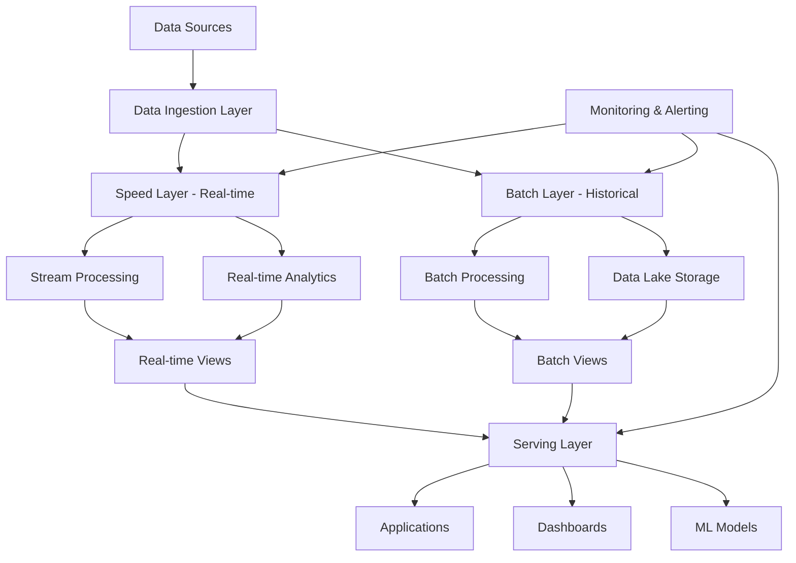
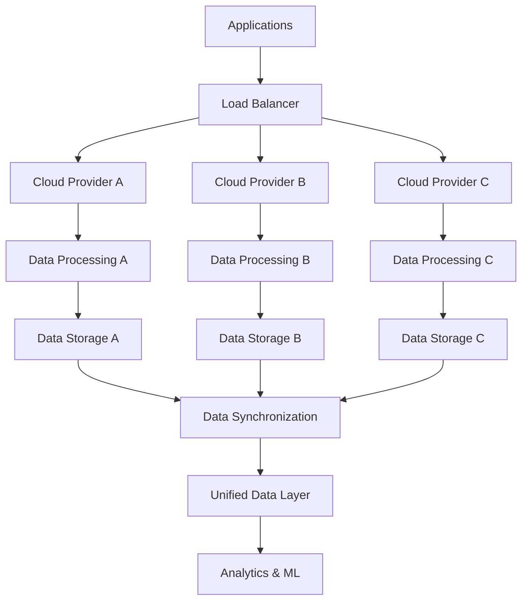
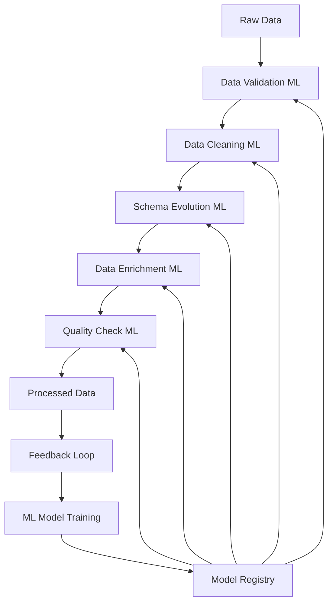
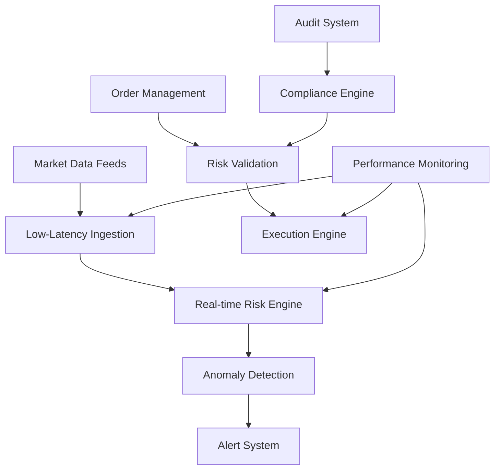

# Niveau 3 : Scénarios Complexes et Solutions sur Mesure

## Objectifs d'Apprentissage
- Résoudre des problèmes de données complexes et multi-dimensionnels
- Concevoir des architectures adaptées aux contraintes spécifiques
- Gérer des volumes de données massifs et des performances critiques
- Implémenter des solutions robustes pour des cas d'usage avancés

## Durée Estimée
**6-8 semaines** (selon votre niveau et disponibilité)

## Niveau Requis
**Avancé** - Avoir validé les Niveaux 1 et 2 ou équivalent

---

## 1. Gestion des Données Massives (Big Data)

### 1.1 Architecture Lambda pour Données Massives

L'architecture Lambda étendue pour gérer des volumes de données massifs nécessite une approche sophistiquée qui combine traitement par lots et streaming en temps réel.



**Optimisations pour Données Massives :**
- **Partitionnement Intelligent** : Division des données par date, région, ou critères métier
- **Compression Avancée** : Utilisation de formats comme Parquet, ORC, ou Avro
- **Cache Distribué** : Mise en cache des données fréquemment accédées
- **Load Balancing** : Distribution équilibrée de la charge de traitement

### 1.2 Stratégies de Partitionnement Avancées

Le partitionnement est crucial pour maintenir les performances avec des volumes massifs de données.

**Partitionnement Multi-Niveaux :**
```sql
-- Exemple de partitionnement par date et région
CREATE TABLE sales_data (
    sale_id BIGINT,
    sale_date DATE,
    region VARCHAR(50),
    amount DECIMAL(10,2),
    customer_id BIGINT
)
PARTITION BY RANGE (YEAR(sale_date))
SUBPARTITION BY HASH (region) SUBPARTITIONS 4;

-- Création des partitions
ALTER TABLE sales_data ADD PARTITION p2023 VALUES LESS THAN (2024);
ALTER TABLE sales_data ADD PARTITION p2024 VALUES LESS THAN (2025);
```

**Partitionnement Dynamique :**
- **Auto-Partitionnement** : Création automatique de nouvelles partitions
- **Partitionnement Adaptatif** : Ajustement basé sur les patterns d'accès
- **Partitionnement Intelligent** : Optimisation basée sur les requêtes fréquentes

### 1.3 Gestion de la Mémoire et des Ressources

La gestion efficace des ressources est essentielle pour traiter des données massives.

**Stratégies de Gestion Mémoire :**
- **Pool de Mémoire** : Réutilisation des objets pour réduire le garbage collection
- **Cache LRU** : Éviction des données les moins récemment utilisées
- **Compression en Mémoire** : Réduction de l'empreinte mémoire
- **Gestion des Fuites** : Détection et correction automatique

**Optimisation des Ressources :**
- **Auto-Scaling** : Ajustement automatique des ressources selon la charge
- **Resource Pools** : Attribution dédiée de ressources par type de traitement
- **Load Shedding** : Réduction de la charge en cas de surcharge
- **Circuit Breaker** : Protection contre les défaillances en cascade

## 2. Architectures Multi-Cloud et Hybrides

### 2.1 Stratégies Multi-Cloud

Les architectures multi-cloud offrent flexibilité, résilience et optimisation des coûts.



**Avantages du Multi-Cloud :**
- **Résilience** : Éviter la dépendance à un seul fournisseur
- **Optimisation des Coûts** : Utiliser le meilleur prix pour chaque service
- **Performance** : Réduire la latence en utilisant des régions proches
- **Conformité** : Respecter les exigences de localisation des données

**Défis et Solutions :**
- **Complexité de Gestion** : Outils d'orchestration centralisés
- **Synchronisation des Données** : Réplication asynchrone avec cohérence finale
- **Sécurité** : Chiffrement et gestion des clés unifiés
- **Monitoring** : Observabilité centralisée sur tous les clouds

### 2.2 Architectures Hybrides

Les architectures hybrides combinent cloud public et infrastructure on-premise.

**Patterns Hybrides :**
- **Burst to Cloud** : Utilisation du cloud pour les pics de charge
- **Data Gravity** : Maintien des données critiques on-premise
- **Edge Computing** : Traitement local avec synchronisation cloud
- **Disaster Recovery** : Sauvegarde cloud de l'infrastructure on-premise

**Implémentation :**
```python
# Exemple de configuration hybride
class HybridDataPipeline:
    def __init__(self, on_prem_config, cloud_config):
        self.on_prem_storage = OnPremiseStorage(on_prem_config)
        self.cloud_storage = CloudStorage(cloud_config)
        self.sync_manager = DataSyncManager()
    
    def process_data(self, data, location='auto'):
        if location == 'auto':
            location = self._determine_optimal_location(data)
        
        if location == 'on_prem':
            return self.on_prem_storage.process(data)
        else:
            return self.cloud_storage.process(data)
    
    def sync_data(self):
        return self.sync_manager.synchronize(
            self.on_prem_storage, 
            self.cloud_storage
        )
```

## 3. Traitement des Données en Temps Réel Avancé

### 3.1 Streaming Complexe avec Apache Flink

Apache Flink permet de gérer des scénarios de streaming complexes avec des garanties de cohérence.

**Patterns de Streaming Avancés :**
- **Event Time Processing** : Gestion des événements basée sur leur timestamp réel
- **Watermarking** : Gestion des événements tardifs et de la latence
- **Stateful Processing** : Maintien d'état entre les événements
- **CEP (Complex Event Processing)** : Détection de patterns complexes

**Exemple d'Application Flink :**
```python
from pyflink.datastream import StreamExecutionEnvironment
from pyflink.table import StreamTableEnvironment, EnvironmentSettings

# Configuration de l'environnement
env = StreamExecutionEnvironment.get_execution_environment()
settings = EnvironmentSettings.new_instance().in_streaming_mode().build()
t_env = StreamTableEnvironment.create(env, settings)

# Définition d'une table de streaming
t_env.execute_sql("""
    CREATE TABLE user_events (
        user_id STRING,
        event_type STRING,
        event_time TIMESTAMP(3),
        properties STRING,
        WATERMARK FOR event_time AS event_time - INTERVAL '5' SECOND
    ) WITH (
        'connector' = 'kafka',
        'topic' = 'user-events',
        'properties.bootstrap.servers' = 'localhost:9092',
        'properties.group.id' = 'user-analytics',
        'format' = 'json'
    )
""")

# Requête de streaming complexe
result = t_env.execute_sql("""
    SELECT 
        user_id,
        COUNT(*) as event_count,
        TUMBLE_START(event_time, INTERVAL '1' HOUR) as window_start
    FROM user_events
    WHERE event_time >= CURRENT_TIMESTAMP - INTERVAL '24' HOUR
    GROUP BY user_id, TUMBLE(event_time, INTERVAL '1' HOUR)
    HAVING COUNT(*) > 10
""")
```

### 3.2 Gestion des Défaillances et Récupération

La robustesse des systèmes de streaming est cruciale pour la production.

**Stratégies de Récupération :**
- **Checkpointing** : Sauvegarde périodique de l'état
- **Savepoints** : Points de sauvegarde manuels pour les mises à jour
- **Failover Automatique** : Basculement vers des instances de secours
- **Reprocessing** : Retraitement des données en cas d'échec

**Monitoring et Alerting :**
```python
class StreamingHealthMonitor:
    def __init__(self):
        self.metrics = {}
        self.alert_thresholds = {
            'latency_ms': 1000,
            'error_rate': 0.01,
            'throughput_events_per_sec': 1000
        }
    
    def check_health(self, metrics):
        alerts = []
        
        if metrics['latency_ms'] > self.alert_thresholds['latency_ms']:
            alerts.append(f"High latency: {metrics['latency_ms']}ms")
        
        if metrics['error_rate'] > self.alert_thresholds['error_rate']:
            alerts.append(f"High error rate: {metrics['error_rate']}")
        
        if metrics['throughput'] < self.alert_thresholds['throughput_events_per_sec']:
            alerts.append(f"Low throughput: {metrics['throughput']} events/sec")
        
        return alerts
```

## 4. Machine Learning et IA dans les Pipelines de Données

### 4.1 Intégration ML dans les Pipelines ETL

L'intégration du machine learning dans les pipelines ETL permet l'automatisation et l'optimisation.

**Cas d'Usage :**
- **Data Quality ML** : Détection automatique d'anomalies
- **Schema Evolution** : Adaptation automatique des schémas
- **Data Enrichment** : Enrichissement automatique des données
- **Anomaly Detection** : Détection de fraudes ou d'erreurs

**Architecture ML-ETL :**


**Implémentation Python :**
```python
import mlflow
from sklearn.ensemble import IsolationForest
import pandas as pd

class MLEnhancedETL:
    def __init__(self):
        self.anomaly_detector = None
        self.data_enricher = None
        mlflow.set_tracking_uri("sqlite:///mlflow.db")
    
    def train_anomaly_detector(self, training_data):
        with mlflow.start_run():
            self.anomaly_detector = IsolationForest(contamination=0.1)
            self.anomaly_detector.fit(training_data)
            
            mlflow.sklearn.log_model(self.anomaly_detector, "anomaly_detector")
            mlflow.log_metric("contamination", 0.1)
    
    def process_data(self, data):
        # Détection d'anomalies
        anomalies = self.anomaly_detector.predict(data)
        clean_data = data[anomalies == 1]
        
        # Enrichissement des données
        enriched_data = self._enrich_data(clean_data)
        
        return enriched_data
    
    def _enrich_data(self, data):
        # Logique d'enrichissement basée sur ML
        # Exemple : prédiction de valeurs manquantes
        return data
```

### 4.2 Feature Engineering Automatisé

L'automatisation du feature engineering améliore la qualité des modèles ML.

**Techniques Automatisées :**
- **Feature Selection** : Sélection automatique des features pertinentes
- **Feature Generation** : Création automatique de nouvelles features
- **Feature Scaling** : Normalisation automatique des données
- **Feature Encoding** : Encodage automatique des variables catégorielles

**Pipeline de Feature Engineering :**
```python
from feature_engine.encoding import RareLabelEncoder
from feature_engine.imputation import MeanMedianImputer
from feature_engine.transformation import PowerTransformer
from feature_engine.selection import SelectByShuffling

class AutomatedFeatureEngineering:
    def __init__(self):
        self.preprocessors = {
            'imputer': MeanMedianImputer(imputation_method='median'),
            'encoder': RareLabelEncoder(tol=0.05, n_categories=10),
            'transformer': PowerTransformer(variables=['numeric_features']),
            'selector': SelectByShuffling(threshold=0.01, random_state=42)
        }
    
    def fit_transform(self, X_train, y_train):
        # Application séquentielle des préprocesseurs
        X_processed = X_train.copy()
        
        for name, preprocessor in self.preprocessors.items():
            if hasattr(preprocessor, 'fit'):
                X_processed = preprocessor.fit_transform(X_processed, y_train)
            else:
                X_processed = preprocessor.fit_transform(X_processed)
        
        return X_processed
    
    def transform(self, X_test):
        # Application des transformations sur les données de test
        X_processed = X_test.copy()
        
        for preprocessor in self.preprocessors.values():
            X_processed = preprocessor.transform(X_processed)
        
        return X_processed
```

## 5. Sécurité et Conformité Avancées

### 5.1 Chiffrement et Protection des Données

La sécurité des données est critique dans les environnements de production.

**Stratégies de Chiffrement :**
- **Chiffrement au Repos** : Protection des données stockées
- **Chiffrement en Transit** : Protection des données transmises
- **Chiffrement des Clés** : Gestion sécurisée des clés de chiffrement
- **Chiffrement Homomorphique** : Traitement de données chiffrées

**Implémentation du Chiffrement :**
```python
from cryptography.fernet import Fernet
from cryptography.hazmat.primitives import hashes
from cryptography.hazmat.primitives.kdf.pbkdf2 import PBKDF2HMAC
import base64
import os

class DataEncryption:
    def __init__(self, master_key=None):
        if master_key is None:
            master_key = Fernet.generate_key()
        
        self.master_key = master_key
        self.cipher_suite = Fernet(master_key)
    
    def encrypt_data(self, data):
        if isinstance(data, str):
            data = data.encode()
        
        encrypted_data = self.cipher_suite.encrypt(data)
        return base64.b64encode(encrypted_data).decode()
    
    def decrypt_data(self, encrypted_data):
        encrypted_bytes = base64.b64decode(encrypted_data.encode())
        decrypted_data = self.cipher_suite.decrypt(encrypted_bytes)
        
        try:
            return decrypted_data.decode()
        except UnicodeDecodeError:
            return decrypted_data
    
    def rotate_keys(self):
        new_key = Fernet.generate_key()
        # Logique de rotation des clés
        return new_key
```

### 5.2 Gestion des Accès et Audit

La gestion des accès et l'audit sont essentiels pour la conformité.

**Contrôles d'Accès :**
- **RBAC (Role-Based Access Control)** : Attribution des permissions par rôle
- **ABAC (Attribute-Based Access Control)** : Contrôle basé sur les attributs
- **Principe du Moindre Privilège** : Accès minimal nécessaire
- **Séparation des Responsabilités** : Division des tâches sensibles

**Système d'Audit :**
```python
import logging
from datetime import datetime
from typing import Dict, Any

class AuditLogger:
    def __init__(self, log_file="audit.log"):
        self.logger = logging.getLogger("audit")
        self.logger.setLevel(logging.INFO)
        
        handler = logging.FileHandler(log_file)
        formatter = logging.Formatter(
            '%(asctime)s - %(user)s - %(action)s - %(resource)s - %(status)s'
        )
        handler.setFormatter(formatter)
        self.logger.addHandler(handler)
    
    def log_access(self, user: str, action: str, resource: str, status: str):
        self.logger.info("", extra={
            'user': user,
            'action': action,
            'resource': resource,
            'status': status
        })
    
    def log_data_access(self, user: str, dataset: str, operation: str):
        self.log_access(user, f"data_{operation}", dataset, "success")
    
    def log_system_change(self, user: str, component: str, change: str):
        self.log_access(user, f"system_{change}", component, "success")
```

## 6. Projets Pratiques Avancés

### 6.1 Projet : Système de Trading en Temps Réel

**Objectif :** Concevoir un système de trading en temps réel avec gestion des risques.

**Exigences :**
- Ingestion de données de marché en streaming
- Calcul de métriques de risque en temps réel
- Détection d'anomalies et alertes
- Conformité réglementaire (MiFID II, Basel III)
- Performance sub-milliseconde

**Architecture Recommandée :**


### 6.2 Projet : Plateforme de Recommandation Multi-Modal

**Objectif :** Développer une plateforme de recommandation pour du contenu multimédia.

**Exigences :**
- Traitement de texte, image, audio et vidéo
- Modèles de recommandation personnalisés
- A/B testing et optimisation continue
- Scalabilité pour des millions d'utilisateurs
- Intégration avec des APIs externes

**Technologies Recommandées :**
- **Traitement** : Apache Spark, TensorFlow, PyTorch
- **Stockage** : Cassandra, Redis, Elasticsearch
- **Streaming** : Apache Kafka, Apache Flink
- **MLOps** : MLflow, Kubeflow, Airflow

## 7. Évaluation et Validation

### 7.1 Critères d'Évaluation

**Maîtrise Technique (35%)**
- Compréhension des architectures complexes
- Capacité à résoudre des problèmes multi-dimensionnels
- Maîtrise des technologies avancées

**Architecture et Design (30%)**
- Qualité des solutions proposées
- Robustesse et évolutivité des architectures
- Gestion des contraintes et des risques

**Innovation et Créativité (20%)**
- Originalité des approches
- Adaptation aux contraintes spécifiques
- Solutions innovantes et efficaces

**Documentation et Communication (15%)**
- Clarté de la documentation technique
- Qualité des présentations
- Communication des choix techniques

### 7.2 Validation des Compétences

**Niveau Avancé Validé :**
- Capacité à concevoir des architectures complexes
- Maîtrise des technologies de pointe
- Expérience avec des cas d'usage avancés
- Compétences en résolution de problèmes complexes

**Préparation au Niveau Expert :**
- Bases solides pour les architectures d'entreprise
- Expérience avec des contraintes de production
- Capacité à innover et à optimiser
- Leadership technique et mentorat

---

## Ressources Complémentaires

### Documentation Technique
- [Apache Flink Documentation](https://flink.apache.org/docs/)
- [MLflow Documentation](https://mlflow.org/docs/)
- [Apache Kafka Documentation](https://kafka.apache.org/documentation/)
- [Data Mesh Principles](https://martinfowler.com/articles/data-mesh-principles.html)

### Livres Recommandés
- "Streaming Systems" par Tyler Akidau, Slava Chernyak, et Reuven Lax
- "Designing Data-Intensive Applications" par Martin Kleppmann
- "Machine Learning Engineering" par Andriy Burkov
- "Building Microservices" par Sam Newman

### Communautés et Forums
- [Apache Flink Community](https://flink.apache.org/community/)
- [MLflow Community](https://mlflow.org/community/)
- [Data Engineering Subreddit](https://www.reddit.com/r/dataengineering/)
- [Streaming Systems Community](https://streaming-systems.org/)

---

**Prochaine Étape :** Niveau 4 - Pipelines Transactionnels et Temps Réel

Ce niveau vous a permis de maîtriser les scénarios complexes et de concevoir des solutions sur mesure. Vous êtes maintenant prêt à aborder les pipelines transactionnels et les systèmes en temps réel critiques.
