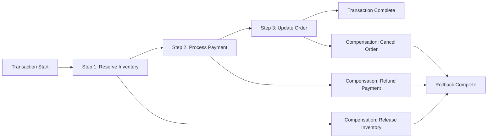
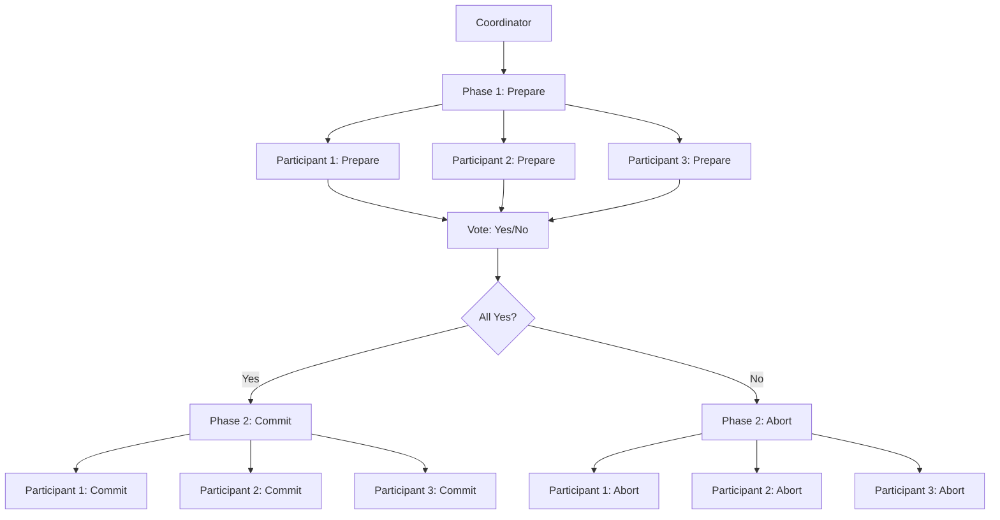
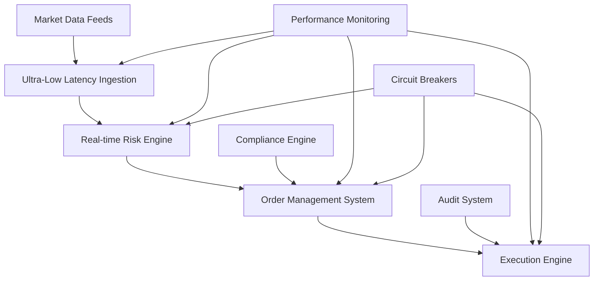

# Niveau 4 : Pipelines Transactionnels et Temps Réel

## Objectifs d'Apprentissage
- Concevoir des pipelines transactionnels robustes et performants
- Implémenter des systèmes en temps réel critiques
- Gérer la cohérence des données dans des environnements distribués
- Assurer la haute disponibilité et la résilience des systèmes

## Durée Estimée
**6-8 semaines** (selon votre niveau et disponibilité)

## Niveau Requis
**Expert** - Avoir validé les Niveaux 1, 2 et 3 ou équivalent

---

## 1. Architectures Transactionnelles Avancées

### 1.1 Patterns de Cohérence des Données

La cohérence des données est cruciale dans les systèmes transactionnels distribués.

**Modèles de Cohérence :**
- **Cohérence Forte (Strong Consistency)** : Toutes les lectures voient la dernière écriture
- **Cohérence Éventuelle (Eventual Consistency)** : Les données convergent vers un état cohérent
- **Cohérence Causale (Causal Consistency)** : Respect des relations causales entre événements
- **Cohérence de Session (Session Consistency)** : Cohérence garantie dans le contexte d'une session

**Implémentation avec SAGA Pattern :**


**Exemple d'Implémentation SAGA :**
```python
from abc import ABC, abstractmethod
from typing import List, Dict, Any
import logging

class SagaStep(ABC):
    def __init__(self, name: str):
        self.name = name
        self.compensation = None
    
    @abstractmethod
    def execute(self, context: Dict[str, Any]) -> bool:
        pass
    
    @abstractmethod
    def compensate(self, context: Dict[str, Any]) -> bool:
        pass

class InventoryReservationStep(SagaStep):
    def __init__(self):
        super().__init__("Inventory Reservation")
    
    def execute(self, context: Dict[str, Any]) -> bool:
        try:
            # Logique de réservation d'inventaire
            inventory_id = context.get('inventory_id')
            quantity = context.get('quantity')
            
            # Simulation de réservation
            if self._reserve_inventory(inventory_id, quantity):
                context['inventory_reserved'] = True
                return True
            return False
        except Exception as e:
            logging.error(f"Failed to reserve inventory: {e}")
            return False
    
    def compensate(self, context: Dict[str, Any]) -> bool:
        try:
            inventory_id = context.get('inventory_id')
            quantity = context.get('quantity')
            
            # Libération de l'inventaire réservé
            if context.get('inventory_reserved'):
                self._release_inventory(inventory_id, quantity)
                context['inventory_reserved'] = False
            return True
        except Exception as e:
            logging.error(f"Failed to compensate inventory: {e}")
            return False
    
    def _reserve_inventory(self, inventory_id: str, quantity: int) -> bool:
        # Implémentation de la réservation
        return True
    
    def _release_inventory(self, inventory_id: str, quantity: int) -> bool:
        # Implémentation de la libération
        return True

class SagaOrchestrator:
    def __init__(self, steps: List[SagaStep]):
        self.steps = steps
        self.logger = logging.getLogger(__name__)
    
    def execute(self, context: Dict[str, Any]) -> bool:
        executed_steps = []
        
        try:
            for step in self.steps:
                self.logger.info(f"Executing step: {step.name}")
                
                if not step.execute(context):
                    self.logger.error(f"Step {step.name} failed, starting compensation")
                    self._compensate(executed_steps, context)
                    return False
                
                executed_steps.append(step)
                self.logger.info(f"Step {step.name} completed successfully")
            
            self.logger.info("All saga steps completed successfully")
            return True
            
        except Exception as e:
            self.logger.error(f"Saga execution failed: {e}")
            self._compensate(executed_steps, context)
            return False
    
    def _compensate(self, executed_steps: List[SagaStep], context: Dict[str, Any]):
        self.logger.info("Starting compensation process")
        
        for step in reversed(executed_steps):
            try:
                self.logger.info(f"Compensating step: {step.name}")
                step.compensate(context)
            except Exception as e:
                self.logger.error(f"Compensation failed for step {step.name}: {e}")

# Utilisation du pattern SAGA
def process_order(order_data: Dict[str, Any]) -> bool:
    steps = [
        InventoryReservationStep(),
        PaymentProcessingStep(),
        OrderUpdateStep()
    ]
    
    orchestrator = SagaOrchestrator(steps)
    context = {
        'inventory_id': order_data['inventory_id'],
        'quantity': order_data['quantity'],
        'payment_amount': order_data['amount'],
        'order_id': order_data['order_id']
    }
    
    return orchestrator.execute(context)
```

### 1.2 Gestion des Transactions Distribuées

Les transactions distribuées nécessitent des mécanismes sophistiqués pour maintenir la cohérence.

**Two-Phase Commit (2PC) :**


**Implémentation 2PC :**
```python
import asyncio
from enum import Enum
from typing import List, Dict, Any
import logging

class TransactionState(Enum):
    INITIAL = "initial"
    PREPARING = "preparing"
    PREPARED = "prepared"
    COMMITTING = "committing"
    COMMITTED = "committed"
    ABORTING = "aborting"
    ABORTED = "aborted"

class Participant:
    def __init__(self, participant_id: str):
        self.participant_id = participant_id
        self.state = TransactionState.INITIAL
        self.logger = logging.getLogger(f"participant_{participant_id}")
    
    async def prepare(self) -> bool:
        try:
            self.logger.info("Preparing transaction")
            # Logique de préparation
            await self._prepare_local_transaction()
            self.state = TransactionState.PREPARED
            self.logger.info("Transaction prepared successfully")
            return True
        except Exception as e:
            self.logger.error(f"Failed to prepare transaction: {e}")
            self.state = TransactionState.ABORTED
            return False
    
    async def commit(self) -> bool:
        try:
            self.logger.info("Committing transaction")
            self.state = TransactionState.COMMITTING
            await self._commit_local_transaction()
            self.state = TransactionState.COMMITTED
            self.logger.info("Transaction committed successfully")
            return True
        except Exception as e:
            self.logger.error(f"Failed to commit transaction: {e}")
            return False
    
    async def abort(self) -> bool:
        try:
            self.logger.info("Aborting transaction")
            self.state = TransactionState.ABORTING
            await self._abort_local_transaction()
            self.state = TransactionState.ABORTED
            self.logger.info("Transaction aborted successfully")
            return True
        except Exception as e:
            self.logger.error(f"Failed to abort transaction: {e}")
            return False
    
    async def _prepare_local_transaction(self):
        # Simulation de préparation
        await asyncio.sleep(0.1)
    
    async def _commit_local_transaction(self):
        # Simulation de commit
        await asyncio.sleep(0.1)
    
    async def _abort_local_transaction(self):
        # Simulation d'abort
        await asyncio.sleep(0.1)

class TwoPhaseCommitCoordinator:
    def __init__(self, participants: List[Participant]):
        self.participants = participants
        self.logger = logging.getLogger("coordinator")
    
    async def execute_transaction(self) -> bool:
        self.logger.info("Starting 2PC transaction")
        
        # Phase 1: Prepare
        prepare_results = await self._prepare_phase()
        
        if not all(prepare_results):
            self.logger.warning("Some participants failed to prepare, aborting")
            await self._abort_phase()
            return False
        
        # Phase 2: Commit
        commit_results = await self._commit_phase()
        
        if not all(commit_results):
            self.logger.error("Some participants failed to commit")
            # Note: À ce stade, certains participants ont déjà commité
            # La récupération nécessite une logique complexe
            return False
        
        self.logger.info("Transaction completed successfully")
        return True
    
    async def _prepare_phase(self) -> List[bool]:
        self.logger.info("Phase 1: Prepare")
        prepare_tasks = [participant.prepare() for participant in self.participants]
        return await asyncio.gather(*prepare_tasks)
    
    async def _commit_phase(self) -> List[bool]:
        self.logger.info("Phase 2: Commit")
        commit_tasks = [participant.commit() for participant in self.participants]
        return await asyncio.gather(*commit_tasks)
    
    async def _abort_phase(self):
        self.logger.info("Phase 2: Abort")
        abort_tasks = [participant.abort() for participant in self.participants]
        await asyncio.gather(*abort_tasks)

# Utilisation du 2PC
async def main():
    participants = [
        Participant("participant_1"),
        Participant("participant_2"),
        Participant("participant_3")
    ]
    
    coordinator = TwoPhaseCommitCoordinator(participants)
    success = await coordinator.execute_transaction()
    
    if success:
        print("Transaction completed successfully")
    else:
        print("Transaction failed")

# asyncio.run(main())
```

## 2. Systèmes en Temps Réel Critiques

### 2.1 Architecture de Latence Ultra-Faible

Les systèmes critiques nécessitent une latence sub-milliseconde.

**Optimisations de Performance :**
- **Lock-Free Data Structures** : Éviter les verrous pour améliorer la concurrence
- **Memory Pools** : Réutilisation des objets pour réduire le garbage collection
- **CPU Affinity** : Attachement des threads à des cœurs CPU spécifiques
- **NUMA Awareness** : Optimisation de l'accès mémoire selon la topologie NUMA

**Implémentation d'une Queue Lock-Free :**
```python
import threading
import time
from typing import Optional, Generic, TypeVar
from collections import deque

T = TypeVar('T')

class LockFreeQueue(Generic[T]):
    def __init__(self, max_size: int = 1000):
        self.max_size = max_size
        self._queue = deque()
        self._lock = threading.Lock()
        self._not_empty = threading.Condition(self._lock)
        self._not_full = threading.Condition(self._lock)
    
    def put(self, item: T, timeout: Optional[float] = None) -> bool:
        with self._lock:
            while len(self._queue) >= self.max_size:
                if timeout is not None:
                    if not self._not_full.wait(timeout):
                        return False
                else:
                    self._not_full.wait()
            
            self._queue.append(item)
            self._not_empty.notify()
            return True
    
    def get(self, timeout: Optional[float] = None) -> Optional[T]:
        with self._lock:
            while len(self._queue) == 0:
                if timeout is not None:
                    if not self._not_empty.wait(timeout):
                        return None
                else:
                    self._not_empty.wait()
            
            item = self._queue.popleft()
            self._not_full.notify()
            return item
    
    def size(self) -> int:
        with self._lock:
            return len(self._queue)
    
    def empty(self) -> bool:
        with self._lock:
            return len(self._queue) == 0

class HighPerformanceProcessor:
    def __init__(self, input_queue: LockFreeQueue, output_queue: LockFreeQueue):
        self.input_queue = input_queue
        self.output_queue = output_queue
        self.running = False
        self.thread = None
    
    def start(self):
        self.running = True
        self.thread = threading.Thread(target=self._process_loop)
        self.thread.start()
    
    def stop(self):
        self.running = False
        if self.thread:
            self.thread.join()
    
    def _process_loop(self):
        while self.running:
            item = self.input_queue.get(timeout=0.001)
            if item is not None:
                processed_item = self._process_item(item)
                self.output_queue.put(processed_item)
    
    def _process_item(self, item):
        # Simulation de traitement
        time.sleep(0.0001)  # 100 microsecondes
        return f"processed_{item}"

# Test de performance
def benchmark_queue():
    input_queue = LockFreeQueue(max_size=10000)
    output_queue = LockFreeQueue(max_size=10000)
    
    processor = HighPerformanceProcessor(input_queue, output_queue)
    processor.start()
    
    # Test de performance
    start_time = time.time()
    
    for i in range(10000):
        input_queue.put(f"item_{i}")
    
    # Attendre le traitement
    while output_queue.size() < 10000:
        time.sleep(0.001)
    
    end_time = time.time()
    throughput = 10000 / (end_time - start_time)
    
    print(f"Throughput: {throughput:.2f} items/second")
    
    processor.stop()
    return throughput
```

### 2.2 Gestion des Défaillances et Récupération

La robustesse est critique dans les systèmes en temps réel.

**Patterns de Récupération :**
- **Circuit Breaker** : Protection contre les défaillances en cascade
- **Retry with Exponential Backoff** : Tentatives de reconnexion intelligentes
- **Bulkhead Pattern** : Isolation des défaillances
- **Health Checks** : Surveillance continue de la santé du système

**Implémentation du Circuit Breaker :**
```python
import time
from enum import Enum
from typing import Callable, Any
import logging

class CircuitState(Enum):
    CLOSED = "closed"      # Normal operation
    OPEN = "open"          # Circuit is open, calls fail fast
    HALF_OPEN = "half_open"  # Testing if service is recovered

class CircuitBreaker:
    def __init__(self, 
                 failure_threshold: int = 5,
                 recovery_timeout: float = 60.0,
                 expected_exception: type = Exception):
        self.failure_threshold = failure_threshold
        self.recovery_timeout = recovery_timeout
        self.expected_exception = expected_exception
        
        self.state = CircuitState.CLOSED
        self.failure_count = 0
        self.last_failure_time = 0
        self.logger = logging.getLogger(__name__)
    
    def call(self, func: Callable, *args, **kwargs) -> Any:
        if self.state == CircuitState.OPEN:
            if self._should_attempt_reset():
                self.logger.info("Attempting to reset circuit breaker")
                self.state = CircuitState.HALF_OPEN
            else:
                raise Exception("Circuit breaker is OPEN")
        
        try:
            result = func(*args, **kwargs)
            self._on_success()
            return result
        except self.expected_exception as e:
            self._on_failure()
            raise e
    
    def _on_success(self):
        self.failure_count = 0
        if self.state == CircuitState.HALF_OPEN:
            self.logger.info("Circuit breaker reset to CLOSED")
            self.state = CircuitState.CLOSED
    
    def _on_failure(self):
        self.failure_count += 1
        self.last_failure_time = time.time()
        
        if self.failure_count >= self.failure_threshold:
            self.logger.warning(f"Circuit breaker opened after {self.failure_count} failures")
            self.state = CircuitState.OPEN
    
    def _should_attempt_reset(self) -> bool:
        return time.time() - self.last_failure_time >= self.recovery_timeout
    
    def get_state(self) -> CircuitState:
        return self.state

# Exemple d'utilisation
def unreliable_service():
    import random
    if random.random() < 0.3:  # 30% de chance d'échec
        raise Exception("Service temporarily unavailable")
    return "Service response"

def test_circuit_breaker():
    breaker = CircuitBreaker(failure_threshold=3, recovery_timeout=5.0)
    
    for i in range(10):
        try:
            result = breaker.call(unreliable_service)
            print(f"Call {i}: Success - {result}")
        except Exception as e:
            print(f"Call {i}: Failed - {e}")
        
        print(f"Circuit state: {breaker.get_state()}")
        time.sleep(0.5)
```

## 3. Pipelines de Données en Temps Réel

### 3.1 Architecture de Streaming Critique

Les pipelines critiques nécessitent une garantie de traitement des événements.

**Patterns de Streaming Critique :**
- **Exactly-Once Semantics** : Garantie qu'un événement est traité exactement une fois
- **Event Sourcing** : Stockage de tous les événements pour la reconstruction d'état
- **CQRS** : Séparation des commandes et des requêtes
- **Outbox Pattern** : Garantie de cohérence entre base de données et messages

**Implémentation de l'Outbox Pattern :**
```python
import json
import uuid
from datetime import datetime
from typing import List, Dict, Any
import sqlite3
import threading

class OutboxMessage:
    def __init__(self, message_id: str, topic: str, payload: Dict[str, Any], 
                 created_at: datetime = None):
        self.message_id = message_id
        self.topic = topic
        self.payload = payload
        self.created_at = created_at or datetime.utcnow()
        self.processed = False
        self.processed_at = None

class OutboxRepository:
    def __init__(self, db_path: str = ":memory:"):
        self.db_path = db_path
        self._init_db()
    
    def _init_db(self):
        with sqlite3.connect(self.db_path) as conn:
            conn.execute("""
                CREATE TABLE IF NOT EXISTS outbox (
                    message_id TEXT PRIMARY KEY,
                    topic TEXT NOT NULL,
                    payload TEXT NOT NULL,
                    created_at TIMESTAMP NOT NULL,
                    processed BOOLEAN DEFAULT FALSE,
                    processed_at TIMESTAMP
                )
            """)
            conn.execute("CREATE INDEX IF NOT EXISTS idx_processed ON outbox(processed)")
    
    def save_message(self, message: OutboxMessage):
        with sqlite3.connect(self.db_path) as conn:
            conn.execute("""
                INSERT INTO outbox (message_id, topic, payload, created_at)
                VALUES (?, ?, ?, ?)
            """, (
                message.message_id,
                message.topic,
                json.dumps(message.payload),
                message.created_at.isoformat()
            ))
    
    def get_unprocessed_messages(self, limit: int = 100) -> List[OutboxMessage]:
        with sqlite3.connect(self.db_path) as conn:
            cursor = conn.execute("""
                SELECT message_id, topic, payload, created_at
                FROM outbox
                WHERE processed = FALSE
                ORDER BY created_at
                LIMIT ?
            """, (limit,))
            
            messages = []
            for row in cursor.fetchall():
                message = OutboxMessage(
                    message_id=row[0],
                    topic=row[1],
                    payload=json.loads(row[2]),
                    created_at=datetime.fromisoformat(row[3])
                )
                messages.append(message)
            
            return messages
    
    def mark_as_processed(self, message_id: str):
        with sqlite3.connect(self.db_path) as conn:
            conn.execute("""
                UPDATE outbox
                SET processed = TRUE, processed_at = ?
                WHERE message_id = ?
            """, (datetime.utcnow().isoformat(), message_id))

class OutboxProcessor:
    def __init__(self, repository: OutboxRepository, message_handlers: Dict[str, callable]):
        self.repository = repository
        self.message_handlers = message_handlers
        self.running = False
        self.thread = None
    
    def start(self):
        self.running = True
        self.thread = threading.Thread(target=self._process_loop)
        self.thread.start()
    
    def stop(self):
        self.running = False
        if self.thread:
            self.thread.join()
    
    def _process_loop(self):
        while self.running:
            messages = self.repository.get_unprocessed_messages(limit=10)
            
            for message in messages:
                try:
                    self._process_message(message)
                    self.repository.mark_as_processed(message.message_id)
                except Exception as e:
                    print(f"Failed to process message {message.message_id}: {e}")
            
            time.sleep(0.1)  # Polling interval
    
    def _process_message(self, message: OutboxMessage):
        handler = self.message_handlers.get(message.topic)
        if handler:
            handler(message.payload)
        else:
            print(f"No handler found for topic: {message.topic}")

# Exemple d'utilisation
def order_created_handler(payload: Dict[str, Any]):
    print(f"Processing order created: {payload}")

def inventory_updated_handler(payload: Dict[str, Any]):
    print(f"Processing inventory update: {payload}")

def test_outbox_pattern():
    # Création du repository et du processeur
    repository = OutboxRepository()
    message_handlers = {
        "order.created": order_created_handler,
        "inventory.updated": inventory_updated_handler
    }
    
    processor = OutboxProcessor(repository, message_handlers)
    
    # Création de messages dans l'outbox
    messages = [
        OutboxMessage(
            message_id=str(uuid.uuid4()),
            topic="order.created",
            payload={"order_id": "123", "amount": 100.0}
        ),
        OutboxMessage(
            message_id=str(uuid.uuid4()),
            topic="inventory.updated",
            payload={"product_id": "456", "quantity": 50}
        )
    ]
    
    for message in messages:
        repository.save_message(message)
    
    # Démarrage du processeur
    processor.start()
    
    # Attendre le traitement
    time.sleep(2)
    
    processor.stop()
```

### 3.2 Gestion des Défaillances dans les Pipelines

La gestion des défaillances est cruciale pour maintenir la continuité de service.

**Stratégies de Gestion des Défaillances :**
- **Dead Letter Queue** : Stockage des messages qui ne peuvent pas être traités
- **Retry Policies** : Politiques de retry avec backoff exponentiel
- **Circuit Breaker** : Protection contre les défaillances en cascade
- **Graceful Degradation** : Réduction de fonctionnalités en cas de problème

**Implémentation d'une Dead Letter Queue :**
```python
import json
import time
from datetime import datetime
from typing import Dict, Any, Optional, List
import sqlite3

class DeadLetterMessage:
    def __init__(self, message_id: str, original_topic: str, payload: Dict[str, Any],
                 error_message: str, failed_at: datetime = None, retry_count: int = 0):
        self.message_id = message_id
        self.original_topic = original_topic
        self.payload = payload
        self.error_message = error_message
        self.failed_at = failed_at or datetime.utcnow()
        self.retry_count = retry_count

class DeadLetterQueue:
    def __init__(self, db_path: str = ":memory:"):
        self.db_path = db_path
        self._init_db()
    
    def _init_db(self):
        with sqlite3.connect(self.db_path) as conn:
            conn.execute("""
                CREATE TABLE IF NOT EXISTS dead_letter_queue (
                    message_id TEXT PRIMARY KEY,
                    original_topic TEXT NOT NULL,
                    payload TEXT NOT NULL,
                    error_message TEXT NOT NULL,
                    failed_at TIMESTAMP NOT NULL,
                    retry_count INTEGER DEFAULT 0
                )
            """)
            conn.execute("CREATE INDEX IF NOT EXISTS idx_failed_at ON dead_letter_queue(failed_at)")
    
    def add_message(self, message: DeadLetterMessage):
        with sqlite3.connect(self.db_path) as conn:
            conn.execute("""
                INSERT INTO dead_letter_queue 
                (message_id, original_topic, payload, error_message, failed_at, retry_count)
                VALUES (?, ?, ?, ?, ?, ?)
            """, (
                message.message_id,
                message.original_topic,
                json.dumps(message.payload),
                message.error_message,
                message.failed_at.isoformat(),
                message.retry_count
            ))
    
    def get_messages_for_retry(self, max_retries: int = 3, limit: int = 100) -> List[DeadLetterMessage]:
        with sqlite3.connect(self.db_path) as conn:
            cursor = conn.execute("""
                SELECT message_id, original_topic, payload, error_message, failed_at, retry_count
                FROM dead_letter_queue
                WHERE retry_count < ?
                ORDER BY failed_at
                LIMIT ?
            """, (max_retries, limit))
            
            messages = []
            for row in cursor.fetchall():
                message = DeadLetterMessage(
                    message_id=row[0],
                    original_topic=row[1],
                    payload=json.loads(row[2]),
                    error_message=row[3],
                    failed_at=datetime.fromisoformat(row[4]),
                    retry_count=row[5]
                )
                messages.append(message)
            
            return messages
    
    def increment_retry_count(self, message_id: str):
        with sqlite3.connect(self.db_path) as conn:
            conn.execute("""
                UPDATE dead_letter_queue
                SET retry_count = retry_count + 1
                WHERE message_id = ?
            """, (message_id,))
    
    def remove_message(self, message_id: str):
        with sqlite3.connect(self.db_path) as conn:
            conn.execute("DELETE FROM dead_letter_queue WHERE message_id = ?", (message_id,))

class RetryProcessor:
    def __init__(self, dead_letter_queue: DeadLetterQueue, message_handlers: Dict[str, callable],
                 max_retries: int = 3, retry_delay: float = 1.0):
        self.dead_letter_queue = dead_letter_queue
        self.message_handlers = message_handlers
        self.max_retries = max_retries
        self.retry_delay = retry_delay
        self.running = False
        self.thread = None
    
    def start(self):
        self.running = True
        self.thread = threading.Thread(target=self._retry_loop)
        self.thread.start()
    
    def stop(self):
        self.running = False
        if self.thread:
            self.thread.join()
    
    def _retry_loop(self):
        while self.running:
            messages = self.dead_letter_queue.get_messages_for_retry(
                max_retries=self.max_retries
            )
            
            for message in messages:
                try:
                    self._retry_message(message)
                except Exception as e:
                    print(f"Retry failed for message {message.message_id}: {e}")
            
            time.sleep(self.retry_delay)
    
    def _retry_message(self, message: DeadLetterMessage):
        handler = self.message_handlers.get(message.original_topic)
        if handler:
            try:
                handler(message.payload)
                # Succès, supprimer le message
                self.dead_letter_queue.remove_message(message.message_id)
                print(f"Message {message.message_id} retried successfully")
            except Exception as e:
                # Incrémenter le compteur de retry
                self.dead_letter_queue.increment_retry_count(message.message_id)
                print(f"Retry failed for message {message.message_id}: {e}")
```

## 4. Monitoring et Observabilité Avancés

### 4.1 Métriques de Performance Critique

Le monitoring des systèmes critiques nécessite des métriques granulaires.

**Métriques Clés :**
- **Latence P99/P99.9** : Mesure des performances extrêmes
- **Throughput** : Nombre de transactions par seconde
- **Error Rate** : Taux d'erreur en temps réel
- **Resource Utilization** : Utilisation CPU, mémoire, réseau

**Système de Monitoring Avancé :**
```python
import time
import statistics
from collections import deque
from typing import Dict, List, Optional
import threading

class PerformanceMetrics:
    def __init__(self, window_size: int = 1000):
        self.window_size = window_size
        self.latencies = deque(maxlen=window_size)
        self.errors = deque(maxlen=window_size)
        self.throughput = deque(maxlen=window_size)
        self.lock = threading.Lock()
    
    def record_latency(self, latency_ms: float):
        with self.lock:
            self.latencies.append(latency_ms)
    
    def record_error(self, error: Exception):
        with self.lock:
            self.errors.append(error)
    
    def record_throughput(self, tps: float):
        with self.lock:
            self.throughput.append(tps)
    
    def get_latency_stats(self) -> Dict[str, float]:
        with self.lock:
            if not self.latencies:
                return {}
            
            sorted_latencies = sorted(self.latencies)
            n = len(sorted_latencies)
            
            return {
                'count': n,
                'mean': statistics.mean(sorted_latencies),
                'median': statistics.median(sorted_latencies),
                'p95': sorted_latencies[int(0.95 * n)],
                'p99': sorted_latencies[int(0.99 * n)],
                'p99_9': sorted_latencies[int(0.999 * n)],
                'min': min(sorted_latencies),
                'max': max(sorted_latencies)
            }
    
    def get_error_rate(self) -> float:
        with self.lock:
            if not self.latencies:
                return 0.0
            return len(self.errors) / len(self.latencies)
    
    def get_throughput_stats(self) -> Dict[str, float]:
        with self.lock:
            if not self.throughput:
                return {}
            
            return {
                'current': self.throughput[-1] if self.throughput else 0.0,
                'average': statistics.mean(self.throughput),
                'max': max(self.throughput)
            }

class PerformanceMonitor:
    def __init__(self, metrics: PerformanceMetrics):
        self.metrics = metrics
        self.running = False
        self.thread = None
    
    def start(self):
        self.running = True
        self.thread = threading.Thread(target=self._monitoring_loop)
        self.thread.start()
    
    def stop(self):
        self.running = False
        if self.thread:
            self.thread.join()
    
    def _monitoring_loop(self):
        while self.running:
            self._print_metrics()
            time.sleep(5)  # Affichage toutes les 5 secondes
    
    def _print_metrics(self):
        latency_stats = self.metrics.get_latency_stats()
        error_rate = self.metrics.get_error_rate()
        throughput_stats = self.metrics.get_throughput_stats()
        
        print("\n=== Performance Metrics ===")
        if latency_stats:
            print(f"Latency - P99: {latency_stats.get('p99', 0):.2f}ms, "
                  f"P99.9: {latency_stats.get('p99_9', 0):.2f}ms")
        print(f"Error Rate: {error_rate:.4f}")
        if throughput_stats:
            print(f"Throughput - Current: {throughput_stats.get('current', 0):.2f} TPS, "
                  f"Average: {throughput_stats.get('average', 0):.2f} TPS")
        print("=" * 30)

# Exemple d'utilisation
def test_performance_monitoring():
    metrics = PerformanceMetrics()
    monitor = PerformanceMonitor(metrics)
    
    monitor.start()
    
    # Simulation de métriques
    for i in range(100):
        metrics.record_latency(10 + i * 0.1)  # Latence croissante
        metrics.record_throughput(1000 - i * 5)  # Throughput décroissant
        
        if i % 10 == 0:  # Erreur tous les 10 enregistrements
            metrics.record_error(Exception("Simulated error"))
        
        time.sleep(0.1)
    
    time.sleep(2)  # Attendre l'affichage final
    monitor.stop()
```

## 5. Projets Pratiques Critiques

### 5.1 Projet : Système de Trading Haute Fréquence

**Objectif :** Concevoir un système de trading avec latence sub-milliseconde.

**Exigences :**
- Latence < 1ms pour l'exécution des ordres
- Gestion des risques en temps réel
- Conformité réglementaire stricte
- Monitoring des performances en continu

**Architecture Recommandée :**


### 5.2 Projet : Plateforme de Paiement en Temps Réel

**Objectif :** Développer une plateforme de paiement avec garantie de cohérence.

**Exigences :**
- Traitement de millions de transactions par seconde
- Garantie de cohérence ACID
- Gestion des défaillances et récupération
- Conformité PCI-DSS

**Technologies Recommandées :**
- **Base de Données** : PostgreSQL avec extensions de réplication
- **Message Queue** : Apache Kafka avec exactly-once semantics
- **Cache** : Redis avec persistance
- **Monitoring** : Prometheus + Grafana

## 6. Évaluation et Validation

### 6.1 Critères d'Évaluation

**Performance et Latence (30%)**
- Respect des contraintes de latence
- Optimisation des ressources
- Gestion de la charge

**Robustesse et Résilience (30%)**
- Gestion des défaillances
- Récupération automatique
- Monitoring et alerting

**Architecture et Design (25%)**
- Qualité des patterns utilisés
- Évolutivité et maintenabilité
- Gestion de la complexité

**Conformité et Sécurité (15%)**
- Respect des réglementations
- Sécurité des données
- Audit et traçabilité

### 6.2 Validation des Compétences

**Niveau Expert Validé :**
- Capacité à concevoir des systèmes critiques
- Maîtrise des patterns avancés
- Expérience avec des contraintes strictes
- Leadership technique avancé

**Préparation au Niveau Architecte :**
- Vision stratégique des architectures
- Capacité d'innovation technique
- Leadership d'équipes techniques
- Expertise en résolution de problèmes complexes

---

## Ressources Complémentaires

### Documentation Technique
- [Apache Kafka Exactly-Once Semantics](https://kafka.apache.org/documentation/#semantics)
- [Event Sourcing Pattern](https://martinfowler.com/eaaDev/EventSourcing.html)
- [CQRS Pattern](https://martinfowler.com/bliki/CQRS.html)
- [Saga Pattern](https://microservices.io/patterns/data/saga.html)

### Livres Recommandés
- "Designing Data-Intensive Applications" par Martin Kleppmann
- "Building Microservices" par Sam Newman
- "Event Sourcing and CQRS" par Greg Young
- "High Performance MySQL" par Baron Schwartz

### Communautés et Forums
- [High Performance Computing Community](https://www.hpcwire.com/)
- [Low Latency Trading Community](https://www.lowlatency.com/)
- [Event Sourcing Community](https://eventsourcing.com/)
- [Microservices Community](https://microservices.io/)

---

**Prochaine Étape :** Niveau 5 - Entretiens et Tests Techniques

Ce niveau vous a permis de maîtriser les pipelines transactionnels et les systèmes en temps réel critiques. Vous êtes maintenant prêt à aborder les entretiens et tests techniques avec confiance.
